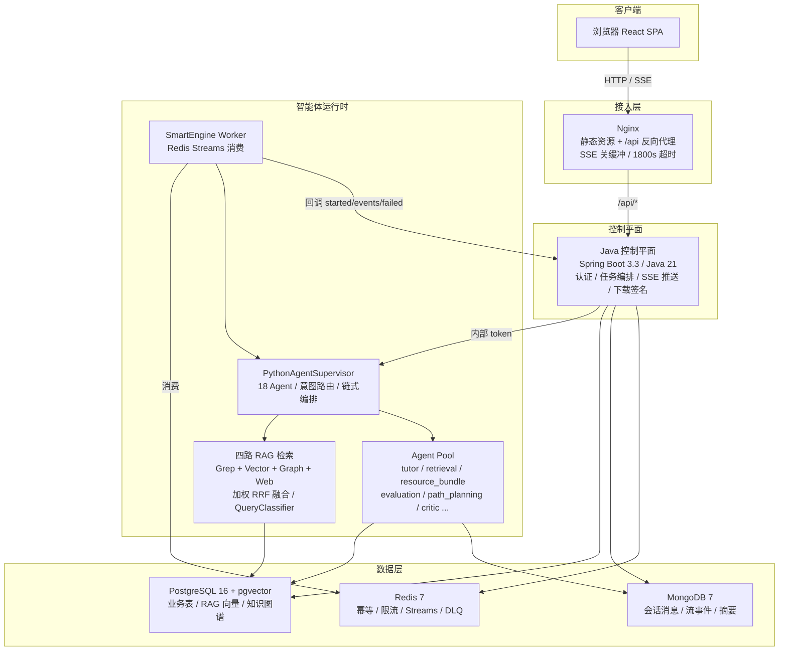
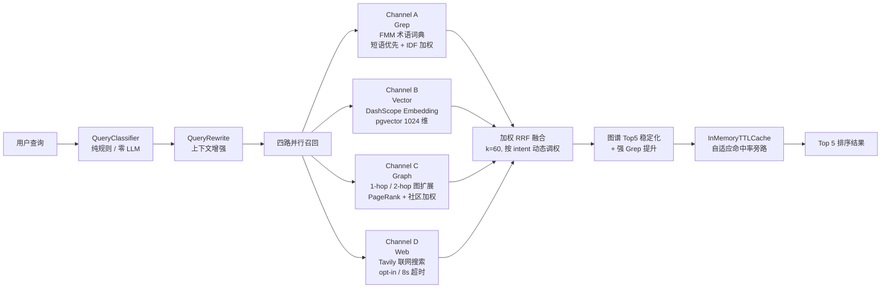

# 智学引擎 ZhiXue Engine

> **AI 驱动的个性化计算机学习系统** -- 多智能体协作、RAG 知识检索、学习画像闭环
>
> 最后更新：2026-06-21

---

## 项目亮点

- **18 个专职智能体协作运行**：基于 LangGraph 构建多智能体运行时，由 `PythonAgentSupervisor` 统一编排，支持动态意图路由、fan-out 并行生成和链式任务组合。
- **四路融合 RAG 检索**：Grep（FMM 术语词典 + 三阶段渐进回退）、Vector（DashScope embedding + pgvector 1024 维）、Graph（1-hop/2-hop 知识图谱扩展 + PageRank + 社区加权）、Web（Tavily 联网搜索）四路并行召回，经加权 RRF 融合（k=60，Graph 权重按 7 种 intent 动态调整 0.5-1.8），纯规则 QueryClassifier 零 LLM 调用分类检索策略；第三阶段 benchmark 中基础 100 题 hit@3 达 100/100，图谱型 100 题 hit@3 达 94/100，且 channelErrorCount=0。
- **完整学习闭环**：从诊断评估、路径规划、资源推送、练习批改到错题复习，形成"学-练-测-评-复"全链路闭环，学习画像与知识掌握图谱实时更新。
- **上下文工程分层架构**：会话记忆、结构化摘要、学习画像、知识图谱、学习计划、练习结果六层记忆分层持久化，`SnapshotBuilder` 聚合为系统提示词，`ConversationCompactor` 智能压缩长对话。
- **无伪生成边界保障**：可发布资源必须携带 `generatedBy=LLM`、`contentOrigin=LLM`、`provider`、`model`、`agentName`、`evidenceIds`、`fallback=false` 等标识，Python/Java/前端三层共同校验。
- **悬浮语音助手**：全局麦克风入口，AudioWorklet 16k PCM 采集，百炼 Qwen 实时 ASR/TTS，支持打断式 cancel、语音命令解析和页面上下文问答。
- **长任务可靠执行**：Redis Streams 异步队列 + Java SSE 推送，Nginx 1800 秒读取超时，支撑 >5 分钟资源生成任务不截断。

---

## 功能概览

| 功能模块 | 说明 | 核心技术 |
|---|---|---|
| 智能问答 | 文字/图片/深度推理/联网搜索，多轮历史，SSE 逐字渲染 | 动态意图路由、多模态理解 |
| 资源生成 | 文档、PPT、思维导图、代码、练习、视频等多类型并发生成 | LangGraph fan-out、18 Agent 并行 |
| 个性化学习方案 | 自动聚合学生画像、进度、知识掌握、错题，输出学习路径与资源推荐 | 7-Stage Pipeline、Profile-driven |
| 学习效果诊断 | 诊断薄弱知识点，输出掌握度矩阵与改进建议 | 评估 Agent、知识图谱分析 |
| 练习与批改 | 智能出题、判题、反馈，自动更新知识掌握度 | Practice/Judge Agent |
| 错题本与复习 | SM-2 间隔重复算法组织复习计划，按主题归并错题 | 间隔重复调度 |
| 学习画像 | 多维度学习特征建模，知识掌握图谱可视化 | Profile Registry、Graph Store |
| 悬浮语音助手 | 实时 ASR/TTS、语音命令解析、页面上下文问答、朗读控制 | AudioWorklet、百炼 Qwen |
| 知识库检索 | 642 wiki + 499 资源文档向量化，四路融合 RAG | pgvector、RRF 融合 |

---

## 系统架构



**核心契约**：浏览器只访问前端（端口 80）和 Java `/api/*`（端口 8081）。Python Agent 的 `/internal/*` 接口仅由 Java 通过 `X-Zhixue-Internal-Token` 调用，"Java 是唯一入口"的架构契约不可破坏。

---

## 技术栈

| 层 | 技术 | 说明 |
|---|---|---|
| **前端** | React 18 + TypeScript + Vite + Tailwind CSS | SPA，fetch + ReadableStream 解析 SSE |
| **接入** | Nginx | 静态资源托管、/api 反向代理、SSE 缓冲关闭 |
| **控制平面** | Java 21 + Spring Boot 3.3 + Spring Security | JWT 鉴权、任务编排、SSE 推送、下载签名 |
| **智能体** | Python 3.11 + FastAPI + LangGraph + LangChain | 18 Agent 运行时、Supervisor 编排、流式执行 |
| **向量/业务库** | PostgreSQL 16 + pgvector | 三 schema（app/rag/storage）、1024 维向量 |
| **文档库** | MongoDB 7 | 会话消息、流事件、结构化摘要 |
| **缓存/队列** | Redis 7 Alpine (AOF) | 幂等、限流、Streams 消息队列、DLQ |
| **语音** | 百炼 Qwen (ASR/TTS) | 实时语音识别与合成，AudioWorklet 采集 |
| **部署** | Docker Compose | 6 服务一键部署，数据卷持久化 |

---

## 快速开始

> **注意**：联调/演示环境只允许 `docker cp` 热更新，禁止 `docker compose build`、`docker compose up --build`、`--force-recreate` 和重建容器。以下命令仅用于全新空环境部署。

### 第 1 步：配置环境变量

```bash
cp .env.example .env
# 编辑 .env，必须配置以下变量：
#   POSTGRES_PASSWORD      — 数据库密码
#   APP_JWT_SECRET         — JWT 签名密钥（>=32 字节）
#   PYTHON_AGENT_INTERNAL_TOKEN — Java ↔ Python 内部通信令牌
#   AI_OPENAI_COMPATIBLE_API_KEY — LLM API 密钥
#   EMBEDDING_API_KEY      — 向量嵌入 API 密钥
# 可选：
#   VOICE_API_KEY / BAILIAN_API_KEY — 语音助手密钥
#   TAVILY_API_KEY         — 联网搜索密钥
```

### 第 2 步：启动服务

```bash
docker compose up -d --build
```

### 第 3 步：验证

```bash
docker compose ps                              # 数据服务/Python healthy，app/frontend Up
curl -s http://localhost:8081/api/health       # Java 控制平面 → 200
curl -s http://localhost:8000/health           # Python Agent → 200
```

浏览器访问 `http://localhost/` 即可使用。

---

## 本地开发

仅启动数据层容器，各服务在宿主机运行：

```bash
docker compose up -d postgres mongo redis
```

### 前端

```bash
cd frontend
pnpm install
pnpm dev                       # Vite dev server → http://localhost:5173
```

### Java 控制平面

```bash
cd project
mvn spring-boot:run            # → http://localhost:8081
```

### Python Agent

```bash
cd python-agent
python -m venv .venv
# Linux/macOS:
source .venv/bin/activate
# Windows PowerShell:
# .\.venv\Scripts\Activate.ps1
pip install -r requirements.txt
uvicorn server:app --host 0.0.0.0 --port 8000 --reload
```

---

## 开发与联调约束

| 约束 | 要求 |
|---|---|
| Java 唯一入口 | 前端只访问 `/api/*`，不得直连 Python `/internal/*` |
| SSE 协议 | Wire format 固定为 `event:` + `data:`，新增事件需同步 `contracts/sse-events.schema.json`、Java 转发和前端解析 |
| 热更新 | 联调/演示环境只允许 `docker cp`，不得 build、recreate 或修改 Compose 拓扑 |
| 向量维度 | Embedding/RAG 向量维度固定 1024 |
| LLM Key | 正式用户/演示任务使用设置页保存的用户 Key 和模型；系统/环境 Key 只用于测试和联调 |
| 缓存与清理 | Redis key、取消标记、运行时缓存必须带 TTL；生成文件写入 sandbox 并由清理循环回收 |

---

## 项目结构

```text
zhixue-engine/
├── contracts/                     # SSE 事件 JSON Schema 契约定义
├── docs/                          # 架构文档、部署指南、专题设计、实验日志
├── frontend/                      # React + Vite + Tailwind 前端
│   └── src/
│       ├── api/                   # API 客户端封装
│       ├── components/            # 通用组件（Layout、Markdown、语音助手、PPTist 等）
│       ├── pages/                 # 页面与页面级 hooks/store
│       ├── utils/                 # 下载、事件总线、语音桥接、Markdown 清洗
│       └── test/                  # Vitest 测试配置
├── migrations/                    # 数据库迁移脚本
├── project/                       # Java Spring Boot 控制平面
│   └── src/main/java/com/project/
│       ├── api/                   # REST 控制器与 DTO
│       ├── application/           # 业务逻辑（对话、任务、画像、错题本）
│       ├── config/                # Spring Security、CORS、Redis、WebSocket 配置
│       ├── domain/                # JPA 领域模型与 Repository
│       ├── infrastructure/        # Python/语音/限流/设置等基础设施适配器
│       └── security/              # JWT、内部 Token、认证用户解析
├── python-agent/                  # Python FastAPI + 多智能体运行时
│   └── src/ai_modules/
│       ├── agents/                # 18 个专职 Agent 实现
│       ├── generation/            # 资源生成器（文档/PPT/思维导图/视频等）
│       ├── llms/                  # LLM 客户端封装
│       ├── memory/                # 记忆系统（会话/画像/知识图谱/计划）
│       └── runtime/               # Supervisor 编排与 SnapshotBuilder
├── tests/                         # 端到端与系统测试
├── wiki/                          # RAG 原始知识文档（642 wiki + 499 资源）
├── docker-compose.yml             # 6 服务编排
├── init.sql                       # PostgreSQL 初始化（三 schema + 枚举 + 表）
├── mongo-init.js                  # MongoDB 初始化
└── vector_data.dump               # 预置向量数据（自动恢复）
```

---

## 核心能力详述

### 多智能体运行时

Python `PythonAgentSupervisor` 注册 18 个 Agent，通过 `supervisor_routes.json` 和 `QueryClassifier` 实现动态意图路由。每个 `serviceType` 对应一条或多条任务链路：

| serviceType | 主要链路 | 说明 |
|---|---|---|
| `TUTORING` | 动态路由：tutor / query_rewrite→retrieval→tutor / 图片/深度推理链路 | 意图分类器根据寒暄、追问、图片题等切换 |
| `RESOURCE_GENERATION` | query_rewrite→retrieval→resource_bundle | LangGraph 资源包 Graph，按类型 fan-out 并发 |
| `VIDEO_GENERATION` | query_rewrite→retrieval→video_generator | 脚本→语音→数字人→最终资源事件 |
| `PRACTICE_JUDGE` | practice→judge→profile | 出题、判题、反馈和画像更新 |
| `PERSONALIZED_LEARNING` | profile→evaluation→query_rewrite→retrieval→path_planning→resource_push→critic | 7-Stage 个性化学习主入口 |
| `EVALUATION` | evaluation | 学习效果诊断，产出 masteryDiagnosis |

### RAG 检索（核心亮点）

系统采用 **四路召回 + 加权 RRF 融合** 的混合检索架构，由纯规则驱动的 `QueryClassifier`（零 LLM 调用）根据查询意图动态选择检索策略。



Graph-aware 查询会额外启用图谱种子 canonical 化、低价值 `wiki://` seed 跳过、direct evidence Top5 保护，以及 strong grep top3 保护。普通 `LOCAL_HYBRID` 默认路径保持不变，线上向量检索仍使用单次 1 秒 embedding 预算；持久 query embedding cache 仅用于 benchmark 稳定复跑，不扩大普通请求延迟。

**四路召回详解**：

| 通道 | 核心技术 | 策略 |
|---|---|---|
| **Grep** | FMM 前缀 Trie + `rag.term_lexicon` 术语词典 + `rag.synonym_group` 同义词扩展 | 三阶段：短语精确匹配 → FMM 子短语搜索 → Token IDF 覆盖率回退；标题匹配 400 分、正文匹配 200 分 |
| **Vector** | DashScope `text-embedding-v4` + pgvector 余弦距离 | 同时搜索 `knowledge_chunk` 和 `resource_chunk` 两表；线上请求保持 1s 单次 embedding 预算，benchmark 可用持久 query embedding cache 稳定复跑 |
| **Graph** | `rag.wiki_link` 双向边遍历 + `wiki_page_graph_features` PageRank | 1-hop 基础扩展（WIKILINK 权重 2、SHARED_TAG 权重 1）+ 2-hop 深度扩展（衰减 0.45，仅 PREREQUISITE_PATH intent）；得分 = base + query_bonus + community_bonus + pagerank_bonus |
| **Web** | Tavily API | 严格 opt-in，时间敏感查询自动追加当前日期，8 秒超时 |

**加权 RRF 融合公式**：

```
RRF_score(item) = Σ weight × priority_boost × slug_penalty / (k + rank + 1)
```

| 参数 | 默认值 | 说明 |
|---|---|---|
| `k` | 60 | RRF 平滑常数 |
| `grep_weight` | 3.0 | 短语匹配额外 1.5x 加成 |
| `vector_weight` | 5.0 | 语义检索主权重 |
| `graph_weight` | 0.5-1.8 | 按 intent 动态调整（PREREQUISITE_PATH 最高 1.8） |
| `web_weight` | 1.5 | 联网搜索 |

**QueryClassifier**：纯规则驱动的本地分类器，零 LLM 调用，决策树包含 IMAGE_QUESTION、SMALL_TALK、ANSWER_PREVIOUS、7 种 Graph intent（PREREQUISITE_PATH / COMPARISON / MULTI_HOP_RELATION 等）、CURRENT_INFO、ERROR_DEBUG、PROCEDURAL、FOLLOW_UP、NEW_CONCEPT 等类型，每种映射到不同检索策略（NONE / CONTEXT_ONLY / LOCAL_GREP_FIRST / LOCAL_HYBRID / WEB_AUGMENTED / DEEP_EVIDENCE）。

**RAG 质量指标**（第三阶段报告支撑）：

| 测试集 | hit@1 | hit@3 | 平均延迟 | P95 延迟 |
|---|---|---|---|---|
| 基础 100 题 | 100% | **100/100** | 861.07ms | 972.03ms |
| 图谱型 100 题 | 56% | **94/100** | 652.38ms | 765.35ms |

图谱型测试额外指标：primaryTop5 98.0%、evidenceNodeRecallTop5 85.67%、completeEvidenceTop5 63.0%、channelErrorCount 0、overallPass=true。

报告文件：`python-agent/reports/rag_100_phase3_20260614.json`、`python-agent/reports/graph_rag_100_phase3_pass_20260614.json`。Graph benchmark summary 固化了 `passHitAt3`、`passLatency`、`passEvidenceRecall`、`passCompleteEvidence`、`overallPass` 等门槛字段，`lowEvidenceRecordsByIntent` 用于后续低召回样本修复。

预置向量数据随仓库提供（`vector_data.dump`，642 wiki + 499 资源文档），首次部署自动恢复。

### 记忆系统与上下文工程

系统将"长期记忆"与"本次任务上下文"分层处理：

| 层 | 存储 | 用途 |
|---|---|---|
| 原始会话记忆 | MongoDB | 多轮问答、图片上下文、流式事件 |
| 结构化会话摘要 | MongoDB | 长对话压缩为主题、目标、薄弱点、未解决问题 |
| 学习画像记忆 | PostgreSQL | 专业方向、知识基础、学习偏好、薄弱点 |
| 知识掌握记忆 | PostgreSQL | 知识点掌握度、依赖关系、学习状态 |
| 学习计划记忆 | PostgreSQL | 当前学习路径、版本快照、计划演化 |
| 练习与错题记忆 | PostgreSQL | 掌握度诊断、错题复习、间隔重复调度 |

上下文工程链路：前端 `learningContext` → Java `PersonalizedLearningContextService` 聚合 30 天信号 → Python `SnapshotBuilder` 整理为 `SystemSnapshot` → Agent system prompt 注入 → 执行结果写回存储形成闭环。

### 长任务 SmartEngine

资源生成、个性化学习方案、学习效果诊断等长任务的执行流程：

1. Java 入队 Redis Streams
2. Python SmartEngine Worker 消费并执行
3. 执行过程中回调 Java 持久化 `started`/`events`/`worker-failed` 事件
4. 前端订阅 Java SSE 推送的 `progress`/`result_chunk`/`resource_file`/`done` 事件
5. Nginx 对 SSE 端点关闭缓冲，1800 秒读取超时保证长任务不截断

### 悬浮语音助手

- 全局右下角麦克风入口，AudioWorklet 采集 16k PCM 音频
- Java `/api/voice/**` 作为唯一语音网关
- 百炼 Qwen 实时 ASR（支持 partial/final 分段识别）
- 流式 TTS 合成朗读，支持停止/暂停/继续/打断式 cancel
- 语音命令解析：停止朗读、打开错题本、开始今日复习、打开个人画像、生成学习计划等
- 页面上下文问答：语音输入可感知当前页面内容

---

## API 概览

### 前端路由

| 路由 | 页面 | 功能 |
|---|---|---|
| `/` | 每日学习工作台 | 学习任务概览与进度追踪 |
| `/chat` | 智能问答 | 多轮对话、图片识别、深度推理 |
| `/engine` | 个性化学习路径 | 知识图谱、学习计划与效果诊断 |
| `/resources` | 资源库 | 语义搜索、分类筛选、资源浏览 |
| `/resources/generation` | 多智能体资源生成 | 文档/PPT/思维导图/视频等并发生成 |
| `/mistakes` | 错题本 | 错题浏览与间隔重复复习 |
| `/notes` | AI 笔记本 | Markdown/Mermaid 笔记与版本管理 |
| `/profile` | 学习画像 | 知识掌握图谱与学习分析 |
| `/knowledge-graph` | 知识图谱 | 知识节点、依赖关系与节点详情 |
| `/settings` | 用户设置 | LLM API Key 与模型路由配置 |
| `/dashboard` | 重定向 | 兼容旧入口，重定向到 `/` |

### Java 对外 API

| 模块 | 端点 | 说明 |
|---|---|---|
| 健康检查 | `GET /api/health` | 服务状态 |
| 认证 | `POST /api/auth/register` `POST /api/auth/login` `POST /api/auth/logout` `GET /api/auth/me` | JWT 认证全生命周期 |
| 对话 | `POST /api/conversations` `GET /api/conversations` `GET /api/conversations/{id}/messages` `POST /api/conversations/{id}/messages/stream` | 会话管理与流式消息 |
| 语音助手 | `POST /api/voice/sessions` `POST /api/voice/transcribe` `POST /api/voice/tts/stream` `POST /api/voice/commands/parse` `GET /api/voice/ws` | 语音会话、ASR、TTS、命令解析、WebSocket |
| SmartEngine | `POST /api/smart-engine/submit` `GET /api/smart-engine/tasks/{taskId}` `GET /api/smart-engine/tasks/{taskId}/stream` `POST /api/smart-engine/tasks/{taskId}/cancel` | 长任务提交、查询、SSE 订阅、取消 |
| 下载 | `GET /api/assets/download/{token}` | 生成资源下载（签名 token，30 分钟过期） |
| 错题本 | `GET /api/mistakes` `PATCH /api/mistakes/{id}` `POST /api/mistakes/review` | 错题管理与复习 |
| 笔记 | `GET/POST /api/notes` `GET /api/notes/search/semantic` `POST /api/notes/{id}/ai/analyze` | 笔记 CRUD、版本、AI 分析与语义搜索 |
| 资源库 | `GET /api/resources` `GET /api/resources/search/semantic` `POST /api/resources/{id}/favorite` | 资源浏览、收藏、进度、推荐与语义搜索 |
| 画像 | `GET /api/users/{userId}/profile/current` `GET /api/users/{userId}/profile/analytics` `GET /api/users/{userId}/knowledge-graph` | 学习画像与知识图谱 |
| 学习工作台 | `GET /api/study-workbench/daily` `POST /api/study-workbench/daily/refresh` | 每日学习任务与刷新 |
| 设置 | `GET /api/settings/llm` `POST /api/settings/llm/test` `POST /api/settings/llm/models` | 用户 LLM Provider、模型列表与连通性测试 |

### Python 内部 API（仅供 Java 调用）

| 端点 | 用途 |
|---|---|
| `GET /health` | 容器健康检查 |
| `POST /internal/smart-engine/stream` | 对话流和兼容流式调用 |
| `POST /internal/smart-engine/{taskId}/cancel` | 取消运行中任务 |
| `POST /internal/conversations/{conversationId}/messages` | 写入会话消息 |
| `GET /internal/conversations/{conversationId}/messages` | 读取会话历史 |
| `GET /internal/resources/search/semantic` | 资源库 RAG 语义搜索，必要时补充 Tavily 外部候选 |
| `POST /internal/notes/analyze` | 笔记摘要、关键词和待办分析 |
| `POST /internal/notes/index` | 将用户笔记写入 pgvector 资源分片 |
| `GET /internal/notes/search/semantic` | 用户笔记语义搜索 |

### SSE 事件契约

SSE wire format 固定为：

```text
event: <eventType>
data: <json>
```

事件类型定义在 `contracts/sse-events.schema.json`：

`message` | `progress` | `result_chunk` | `reasoning_chunk` | `resource_file` | `question_batch` | `judge_result` | `done` | `error` | `video_gen:start` | `video_gen:script` | `video_gen:speech` | `video_gen:avatar` | `video_gen:complete`

---

## 数据架构

| 存储 | Schema / 集合 | 主要内容 |
|---|---|---|
| PostgreSQL | `app` | 用户、QNA session、SmartEngine task/event、generated_artifact、画像、练习、审计 |
| PostgreSQL | `rag` | wiki page/link、knowledge document/chunk、resource chunk、profile vector、video_generation_task |
| PostgreSQL | `storage` | resource_object（生成资源元数据） |
| MongoDB | `conversation_threads` / `conversation_messages` / `conversation_stream_events` / `conversation_summaries` | 会话全文、流事件、结构化摘要 |
| Redis | — | 幂等 key、限流、SmartEngine task stream、DLQ、cancel marker、运行时缓存 |

---

## 验证命令

```bash
# 服务状态
docker compose ps

# 健康检查
curl -s http://localhost:8081/api/health
curl -s http://localhost:8000/health

# 前端构建验证
cd frontend && npx tsc --noEmit && npx vite build

# Java 测试
cd project && mvn test

# Python 测试
cd python-agent && pytest tests/ -v

# RAG 检索质量（hits@3 >= 90%）
cd python-agent && pytest tests/ -k rag -v

# RAG 第三阶段重点回归
python-agent/.venv/Scripts/pytest.exe python-agent/tests/test_wiki_chunking_tools_error_book.py python-agent/tests/test_graph_intent_plumbing.py python-agent/tests/test_retrieval_services.py -q
```

### 语音助手专项验收

```bash
# 登录获取 JWT
TOKEN=$(curl -s -X POST http://localhost:8081/api/auth/login \
  -H "Content-Type: application/json" \
  -d '{"username":"test","password":"test"}' | jq -r '.token')

# 创建语音会话
curl -s -X POST http://localhost:8081/api/voice/sessions \
  -H "Authorization: Bearer $TOKEN"

# 测试 TTS 流式合成
curl -s -N -X POST http://localhost:8081/api/voice/tts/stream \
  -H "Authorization: Bearer $TOKEN" \
  -H "Content-Type: application/json" \
  --data '{"text":"你好","voice":"Cherry"}'
```

期望：`/api/voice/sessions` 返回 `provider/asrModel/ttsModel`，TTS SSE 返回 `event: audio` 和 `event: done`。

---

## 安全与可靠性

| 安全措施 | 说明 |
|---|---|
| 密钥管理 | `.env` 不提交真实密钥；ASR/TTS 密钥仅存于服务端环境变量 |
| JWT 鉴权 | `APP_JWT_SECRET` >= 32 字节，外部业务 API 默认鉴权 |
| 内部通信 | Java ↔ Python 通过 `PYTHON_AGENT_INTERNAL_TOKEN` 校验 |
| 语音安全 | VOICE_API_KEY 仅 Java 服务端读取，前端不得直连云服务 |
| 幂等与限流 | Redis `SETNX + TTL`，限流和取消标记均有 TTL |
| 下载签名 | 生成资源下载由 Java 签名 token 控制，30 分钟过期 |
| 沙箱清理 | Python 周期清理沙箱目录，默认 2 小时 TTL |
| 端口绑定 | 数据服务宿主机绑定 `127.0.0.1`，不对外暴露 |

---

## 许可证与致谢

本项目为 2026 年中国软件杯参赛作品。

感谢以下开源项目与服务：

### AI / 多智能体框架

- [LangGraph](https://github.com/langchain-ai/langgraph) / [LangChain](https://github.com/langchain-ai/langchain) — 多智能体图编排与 LLM 应用框架
- [DashScope](https://github.com/dashscope/dashscope-sdk-python) — 阿里云百炼 API SDK（Embedding/ASR/TTS）

### 前端

- [React](https://react.dev/) — UI 组件化框架
- [Vite](https://vitejs.dev/) — 极速前端构建工具
- [TypeScript](https://www.typescriptlang.org/) — 静态类型系统
- [Tailwind CSS](https://tailwindcss.com/) — 原子化 CSS 框架
- [React Router](https://reactrouter.com/) — 客户端路由
- [Framer Motion](https://www.framer.com/motion/) — 声明式动画库
- [Recharts](https://recharts.org/) — React 图表组件
- [Mermaid](https://mermaid.js.org/) — 流程图与图表渲染引擎
- [KaTeX](https://katex.org/) — 数学公式排版引擎
- [react-markdown](https://github.com/remarkjs/react-markdown) / [remark-gfm](https://github.com/remarkjs/remark-gfm) — Markdown 与 GFM 渲染
- [react-syntax-highlighter](https://github.com/react-syntax-highlighter/react-syntax-highlighter) — 代码语法高亮
- [Lucide](https://lucide.dev/) — 开源图标库
- [Axios](https://axios-http.com/) — HTTP 客户端
- [react-virtuoso](https://virtuoso.dev/) — 高性能虚拟滚动
- [DOMPurify](https://github.com/cure53/DOMPurify) — HTML/XSS 消毒过滤

### 后端

- [Spring Boot](https://spring.io/projects/spring-boot) — Java 控制平面框架（含 Spring Security、Spring Data JPA/MongoDB/Redis、Spring WebSocket）
- [JJWT](https://github.com/jwtk/jjwt) — JWT 令牌生成与验证
- [SpringDoc OpenAPI](https://springdoc.org/) — 自动 API 文档生成

### Python Agent

- [FastAPI](https://fastapi.tiangolo.com/) — 高性能异步 Web 框架
- [Uvicorn](https://www.uvicorn.org/) — ASGI 服务器
- [Pydantic](https://docs.pydantic.dev/) — 数据验证与序列化
- [sse-starlette](https://github.com/sysid/sse-starlette) — Server-Sent Events 支持
- [httpx](https://www.python-httpx.org/) — 异步 HTTP 客户端
- [python-pptx](https://github.com/python-openxml/python-pptx) — PowerPoint 文件生成
- [OpenTelemetry](https://opentelemetry.io/) — 可观测性框架

### 数据层

- [PostgreSQL](https://www.postgresql.org/) + [pgvector](https://github.com/pgvector/pgvector) — 关系数据库与向量检索扩展
- [MongoDB](https://www.mongodb.com/) — 文档数据库
- [Redis](https://redis.io/) — 缓存、限流与 Streams 消息队列

### 基础设施

- [Docker](https://www.docker.com/) / [Docker Compose](https://docs.docker.com/compose/) — 容器化部署
- [Nginx](https://nginx.org/) — 反向代理与静态资源服务
- [pytest](https://docs.pytest.org/) — Python 测试框架
