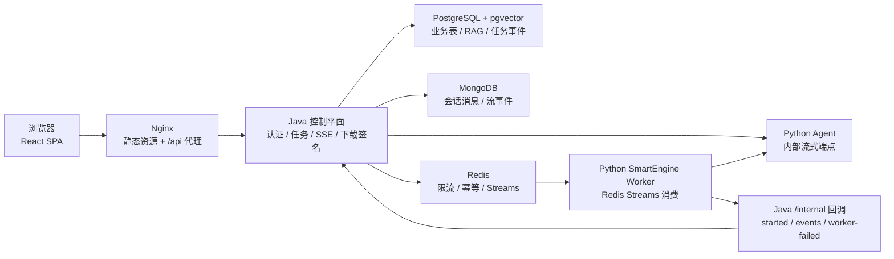

# 智学引擎 ZhiXue Engine

> 最后更新：2026-05-31

智学引擎是一个面向计算机学习场景的 AI 个性化学习系统。项目采用 React 前端、Java 控制平面、Python 多智能体运行时和 PostgreSQL/MongoDB/Redis 数据层，支持流式问答、资源生成、学习评测、路径规划、错题复习和学习画像。

## 当前运行态

当前仓库对应的标准 Docker Compose 栈包含 6 个服务：

| 服务 | 容器 | 技术 | 端口 |
|---|---|---|---|
| 前端入口 | `zhixue-frontend` | Nginx + React SPA | 80 |
| Java 控制平面 | `zhixue-app` | Java 21 + Spring Boot 3.3.12 | 8081 |
| Python Agent | `zhixue-python-agent` | Python 3.11 + FastAPI + LangGraph | 8000 |
| 向量/业务库 | `zhixue-postgres` | PostgreSQL 16 + pgvector | 5432 |
| 会话文档库 | `zhixue-mongo` | MongoDB 7 | 27017 |
| 队列/缓存 | `zhixue-redis` | Redis 7 Alpine + AOF | 6379 |

浏览器只应访问前端和 Java `/api/*`。Python Agent 的 `/internal/*` 接口只供 Java 控制平面通过 `X-Zhixue-Internal-Token` 调用；这条“Java 是唯一入口”的契约不能破坏。



## 核心能力

- **智能问答**：支持文字、图片、深度推理、联网搜索开关和多轮历史；前端通过 `fetch + ReadableStream` 解析 SSE，实现逐字渲染。
- **长任务 SmartEngine**：资源生成、评测、路径规划、练习批改等任务由 Java 入队 Redis Streams，Python Worker 消费执行，再回调 Java 持久化事件，前端订阅 Java SSE。
- **多智能体运行时**：Python `PythonAgentSupervisor` 当前注册 18 个 Agent，并通过 `supervisor_routes.json` 和 QueryClassifier 选择任务链路；`resource_bundle` 是资源生成的虚拟 Graph 节点。
- **RAG 检索**：短语优先 grep、向量语义、知识图谱扩展和可选 Tavily Web 检索，经 RRF 融合；当前报告中基础 100 题 hit@3 98%，图谱型 100 题 hit@3 94%。
- **资源包生成**：`RESOURCE_GENERATION` 使用 LangGraph `ResourceBundleWorkflow`，按 `resourceTypes[]` 并发 fan-out 到文档、PPT、思维导图、代码、练习、视频等资源 Agent。
- **悬浮智能语音助手**：全局右下角麦克风入口，前端采集 16k PCM，Java `/api/voice/**` 作为唯一语音网关，支持百炼 Qwen 实时 ASR、流式 TTS、语音快捷指令解析，并复用现有聊天 SSE。
- **无伪生成边界**：可发布生成资源必须携带 `generatedBy=LLM`、`contentOrigin=LLM`、`provider`、`model`、`agentName`、`evidenceIds`、`fallback=false` 和 `fromCache`，Python、Java、前端三层共同校验。
- **学习画像与错题本**：画像维度规则集中在 `profile_feature_registry.py`，错题本用 SM-2 间隔重复算法组织复习。

## 路由与服务类型

Java `ServiceType` 与 Python `supervisor_routes.json` 对齐：

| serviceType | 主要链路 | 说明 |
|---|---|---|
| `TUTORING` | 动态路由：`tutor` / `query_rewrite -> retrieval -> tutor` / 图片或深度推理链路 | QueryClassifier 根据寒暄、追问、图片题、深度推理等意图切换 |
| `RESOURCE_GENERATION` | `query_rewrite -> retrieval -> resource_bundle` | LangGraph 资源包 Graph，按用户选择 fan-out |
| `VIDEO_GENERATION` | `query_rewrite -> retrieval -> video_generator` | 视频脚本、语音、数字人素材和最终资源事件 |
| `PRACTICE_JUDGE` | `practice -> judge -> profile` | 出题、判题、反馈和画像更新 |
| `PATH_PLANNING` | `path_planning` | 生成学习路径 |
| `EVALUATION` / `LEARNING_EVALUATION` | `evaluation` | 交互题或画像维度评估 |
| `PROFILE_BUILD` | `tutor -> profile` | 画像构建 |
| `RESOURCE_PUSH` | `resource_push` | 资源推荐和可选联网搜索 |

当前注册 Agent 包括：`query_rewrite`、`retrieval`、`document_generator`、`slide_generator`、`reading_generator`、`mindmap_generator`、`code_generator`、`video_generator`、`deep_reasoning`、`tutor`、`profile`、`practice`、`judge`、`path_planning`、`evaluation`、`image_analysis`、`resource_push`、`critic`。

## 关键接口

### 前端路由

| 路由 | 页面 |
|---|---|
| `/` | 智能问答 |
| `/engine` | 智能引擎任务 |
| `/mistakes` | 错题本 |
| `/profile` | 学习画像 |

### Java 对外 API

| 模块 | API |
|---|---|
| 健康检查 | `GET /api/health` |
| 认证 | `POST /api/auth/register`、`POST /api/auth/login`、`POST /api/auth/logout`、`GET /api/auth/me` |
| 对话 | `POST /api/conversations`、`GET /api/conversations`、`GET /api/conversations/{id}/messages`、`POST /api/conversations/{id}/messages/stream` |
| 语音助手 | `POST /api/voice/sessions`、`POST /api/voice/transcribe`、`POST /api/voice/tts/stream`、`POST /api/voice/commands/parse`、`GET /api/voice/ws` |
| 图片 | `POST /api/conversations/images/upload`、`GET /api/conversations/images/{token}` |
| SmartEngine | `POST /api/smart-engine/submit`、`GET /api/smart-engine/tasks/{taskId}`、`GET /api/smart-engine/tasks/{taskId}/stream`、`POST /api/smart-engine/tasks/{taskId}/cancel` |
| 下载 | `GET /api/assets/download/{token}` |
| 错题本 | `GET /api/mistakes`、`PATCH /api/mistakes/{id}`、`POST /api/mistakes/review` |
| 画像 | `GET /api/users/{userId}/profile/current`、`GET /api/users/{userId}/profile/analytics` |

### Python 内部 API

| API | 用途 |
|---|---|
| `GET /health` | 容器健康检查 |
| `POST /internal/smart-engine/stream` | Java 对话流和兼容流式调用 |
| `POST /internal/smart-engine/{taskId}/cancel` | 通知 Python 取消运行中任务 |
| `POST /internal/conversations/{conversationId}/messages` | Java 写入会话消息 |
| `GET /internal/conversations/{conversationId}/messages` | Java 读取会话历史 |

## SSE 事件契约

SSE wire format 固定为：

```text
event: <eventType>
data: <json>

```

事件类型定义在 `contracts/sse-events.schema.json`，当前包括：

`message`、`progress`、`result_chunk`、`resource_file`、`question_batch`、`judge_result`、`done`、`error`、`video_gen:start`、`video_gen:script`、`video_gen:speech`、`video_gen:avatar`、`video_gen:complete`。

Nginx 对 `/api/smart-engine/tasks/{taskId}/stream` 和 `/api/conversations/{conversationId}/messages/stream` 关闭缓冲并设置 1800 秒读取超时，用于支撑长任务不断连。

## 数据架构

| 存储 | 主要内容 |
|---|---|
| PostgreSQL `app` schema | 用户、QNA session、SmartEngine task/event、generated_artifact、画像、练习、审计 |
| PostgreSQL `rag` schema | wiki page/link、knowledge document/chunk、resource chunk、profile vector、video_generation_task |
| PostgreSQL `storage` schema | resource_object |
| MongoDB | `conversation_threads`、`conversation_messages`、`conversation_stream_events` |
| Redis | idempotency key、rate limit、SmartEngine task stream、DLQ、cancel marker、运行时缓存 |

`vector_data.dump` 随仓库提供预置向量数据，首次部署由 `restore_vector_data.sh` 自动恢复。

## 快速开始

> 当前联调/演示环境只允许 `docker cp` 热更新，禁止 `docker compose build`、`docker compose up --build`、`--force-recreate` 和重建容器。下面的 build 命令仅用于全新空环境或明确维护窗口。

```bash
cp .env.example .env
# 编辑 .env，至少配置 POSTGRES_PASSWORD、APP_JWT_SECRET、
# PYTHON_AGENT_INTERNAL_TOKEN、AI_OPENAI_COMPATIBLE_API_KEY 和 EMBEDDING_API_KEY
# 如需启用语音助手，再配置 VOICE_API_KEY 或 BAILIAN_API_KEY
docker compose up -d --build
docker compose ps
curl -s http://localhost:8081/api/health
curl -s http://localhost:8000/health
```

浏览器访问：

```text
http://localhost/
```

## 本地开发

```bash
# 只启动依赖
docker compose up -d postgres mongo redis

# 前端
cd frontend
pnpm install
pnpm dev

# Java
cd project
mvn spring-boot:run

# Python Agent
cd python-agent
python -m venv .venv
source .venv/bin/activate
pip install -r requirements.txt
uvicorn server:app --host 0.0.0.0 --port 8000 --reload
```

Windows PowerShell 激活 Python 虚拟环境：

```powershell
.\.venv\Scripts\Activate.ps1
```

## 验证命令

```bash
docker compose ps
curl -s http://localhost:8081/api/health
curl -s http://localhost:8000/health

cd frontend && npx tsc --noEmit && npx vite build
cd project && mvn test
cd python-agent && pytest tests/ -v
cd python-agent && pytest tests/ -k rag -v
```

语音助手专项验收需要先登录获取 JWT，再检查：

```bash
curl -s -X POST http://localhost:8081/api/voice/sessions -H "Authorization: Bearer <jwt>"
curl -s -N -X POST http://localhost:8081/api/voice/tts/stream \
  -H "Authorization: Bearer <jwt>" \
  -H "Content-Type: application/json" \
  --data '{"text":"hello","voice":"Cherry"}'
```

期望 `/api/voice/sessions` 返回 `provider/asrModel/ttsModel`，TTS SSE 返回 `event: audio` 和 `event: done`。ASR/TTS 密钥只允许放在服务端环境变量或容器外置配置，不要提交到仓库。

当前 RAG 报告文件：

- `python-agent/reports/rag_100_after.json`：基础 100 题 hit@3 98%。
- `python-agent/reports/graph_rag_100_current.json`：图谱型 100 题 hit@3 94%，completeEvidenceTop5 52%。

## 项目结构

```text
.
├── contracts/                     # SSE 事件 JSON Schema
├── docs/                          # 架构、部署、专题设计和实验日志
├── frontend/                      # React + Vite + Tailwind 前端
├── migrations/                    # 数据库迁移脚本
├── project/                       # Java Spring Boot 控制平面
├── python-agent/                  # Python FastAPI + Agent 运行时
├── tests/                         # 端到端与系统测试脚本
├── wiki/                          # RAG 原始知识文档
├── docker-compose.yml
├── init.sql
├── mongo-init.js
└── vector_data.dump
```

## 安全与可靠性

- `.env` 不提交真实密钥。
- `APP_JWT_SECRET` 至少 32 字节，`PYTHON_AGENT_INTERNAL_TOKEN` 与 JWT secret 分离。
- `VOICE_API_KEY`/`BAILIAN_API_KEY` 只在 Java 服务端读取，前端不得直连百炼或暴露 key。
- Java 外部业务 API 默认 JWT 鉴权；内部回调接口由控制器校验 internal token。
- Redis 幂等使用 `SETNX + TTL`，限流和任务取消标记也必须有 TTL。
- 生成资源下载由 Java 签名 token 控制，默认 30 分钟过期。
- 沙箱目录由 Python 周期清理，默认 2 小时 TTL。
- 当前 Compose 文件的数据服务宿主机绑定目标是 `127.0.0.1`；若旧容器仍显示 `0.0.0.0`，需等待维护窗口重建对应容器以应用端口绑定。
