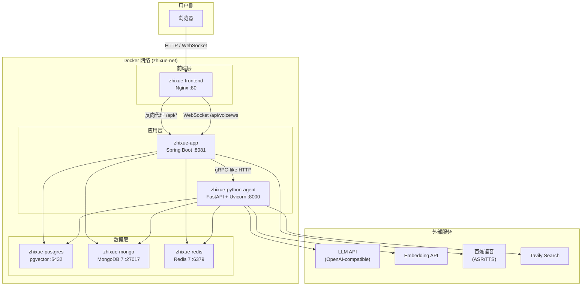
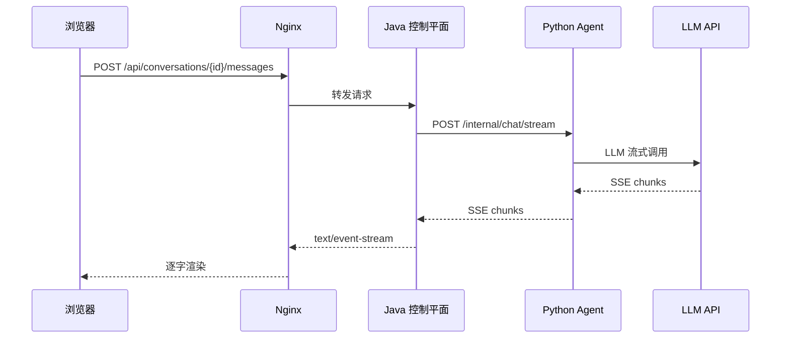

# 智学引擎 -- 部署与运维指南

> 本文档为"智学引擎"全栈项目的完整部署手册，覆盖全新部署、本地开发、热更新及运维全流程。
>
> 最后更新：2026-06-13

---

## 目录

1. [环境要求](#1-环境要求)
2. [架构概览](#2-架构概览)
3. [快速部署（三步启动）](#3-快速部署三步启动)
4. [详细部署步骤](#4-详细部署步骤)
5. [环境变量配置](#5-环境变量配置)
6. [端口与服务入口](#6-端口与服务入口)
7. [部署验证](#7-部署验证)
8. [本地开发环境](#8-本地开发环境)
9. [热更新指南](#9-热更新指南)
10. [运维命令速查](#10-运维命令速查)
11. [故障排查（Q&A）](#11-故障排查qa)
12. [安全检查清单](#12-安全检查清单)
13. [可选功能](#13-可选功能)
14. [资源库外部导入](#14-资源库外部导入)

---

## 1. 环境要求

| 项目 | 最低要求 | 推荐配置 |
|---|---|---|
| 操作系统 | Linux / Windows 10+ / macOS 12+ | Ubuntu 22.04 LTS |
| Docker | 24.0+ | 25.0+ |
| Docker Compose | v2.20+ | 最新版 |
| 内存 | 8 GB | 16 GB |
| 磁盘空间 | 20 GB 可用 | 50 GB SSD |
| Git | 2.30+ | 最新版 |
| 网络 | 可访问 LLM API 端点 | 低延迟稳定连接 |

**外部依赖（必须）：**

- 至少一个 OpenAI-compatible LLM API Key
- Embedding API Key（用于 RAG 向量检索）

**外部依赖（可选）：**

| 依赖 | 用途 | 是否必须 |
|---|---|---|
| Tavily API Key | 联网检索增强 | 否 |
| 百炼语音服务 Key | 悬浮智能语音助手 | 否 |
| 本地 GGUF Judge 模型 | 主观题自动评分 | 否 |

> Java 后端镜像使用 Docker 多阶段构建，宿主机无需预装 Maven。

---

## 2. 架构概览

### 2.1 部署拓扑



### 2.2 数据流



### 2.3 技术栈总览

| 层级 | 技术栈 | 端口 | 容器名 |
|---|---|---|---|
| 前端 | React + Vite + Tailwind CSS + TypeScript | 80 | zhixue-frontend |
| 后端 | Java 21 + Spring Boot 3.3 + Spring Security | 8081 | zhixue-app |
| AI Agent | Python 3.11 + FastAPI + Uvicorn | 8000 | zhixue-python-agent |
| 关系数据库 | PostgreSQL 16 + pgvector | 5432 | zhixue-postgres |
| 文档数据库 | MongoDB 7 | 27017 | zhixue-mongo |
| 缓存/消息队列 | Redis 7 (Streams + AOF) | 6379 | zhixue-redis |
| 反向代理 | Nginx 1.27 | 80 | zhixue-frontend |

---

## 3. 快速部署（三步启动）

适用于全新空环境，最快路径让系统跑起来。

### 第一步：克隆代码并配置环境变量

```bash
git clone <repo-url> zhixue-engine
cd zhixue-engine
cp .env.example .env
```

编辑 `.env`，至少修改以下 5 个必填项：

```env
POSTGRES_PASSWORD=<你的强密码>
APP_JWT_SECRET=<随机32字节以上字符串>
PYTHON_AGENT_INTERNAL_TOKEN=<随机共享密钥>
AI_OPENAI_COMPATIBLE_API_KEY=<LLM API Key>
EMBEDDING_API_KEY=<Embedding API Key>
```

生成随机值：

```bash
# Linux / macOS
openssl rand -base64 32

# Windows PowerShell
[Convert]::ToBase64String((1..32 | ForEach-Object { Get-Random -Maximum 256 }))
```

### 第二步：构建并启动全部服务

```bash
docker compose up -d --build
```

### 第三步：验证服务状态

```bash
docker compose ps
curl -s http://localhost:8081/api/health
curl -s http://localhost:8000/health
```

全部服务 `healthy` 且健康检查返回正常即部署成功。浏览器访问 `http://localhost` 即可使用。

---

## 4. 详细部署步骤

### 4.1 获取代码

```bash
git clone <repo-url> zhixue-engine
cd zhixue-engine
```

### 4.2 配置环境变量

```bash
# Linux / macOS
cp .env.example .env

# Windows PowerShell
Copy-Item .env.example .env
```

编辑 `.env` 文件，参考 [第 5 节](#5-环境变量配置) 完成配置。

### 4.3 构建并启动

全新空环境：

```bash
docker compose up -d --build
```

构建过程说明：

1. **PostgreSQL** -- 启动后自动执行 `init.sql` 创建 schema、表、索引和触发器，然后执行 `restore_vector_data.sh` 从 `vector_data.dump` 恢复预置向量数据
2. **MongoDB** -- 启动后自动执行 `mongo-init.js` 初始化 collection 和索引
3. **Redis** -- 启动时开启 AOF 持久化
4. **Python Agent** -- 等待三个数据服务 healthy 后启动
5. **Java 控制平面** -- 等待所有数据服务和 Python Agent healthy 后启动
6. **前端** -- 等待 Java 服务启动后启动

### 4.4 确认服务状态

```bash
docker compose ps
```

预期输出包含以下 6 个服务，状态均为 `Up` 或 `healthy`：

| 容器名 | 镜像 | 状态 |
|---|---|---|
| zhixue-postgres | pgvector/pgvector:pg16 | healthy |
| zhixue-mongo | mongo:7 | healthy |
| zhixue-redis | redis:7-alpine | healthy |
| zhixue-python-agent | zhixue-python-agent:local | healthy |
| zhixue-app | zhixue-java-app:local | Up |
| zhixue-frontend | zhixue-frontend:local | Up |

---

## 5. 环境变量配置

### 5.1 必填变量

| 变量名 | 说明 | 默认值 | 备注 |
|---|---|---|---|
| `POSTGRES_PASSWORD` | PostgreSQL 密码 | 无（必须配置） | 首次启动后写入 `./data/postgres`，后续修改需同步数据库或清空数据目录 |
| `APP_JWT_SECRET` | JWT 签名密钥 | 无（必须配置） | 至少 32 字节随机字符串 |
| `PYTHON_AGENT_INTERNAL_TOKEN` | Java/Python 内部通信密钥 | 无（必须配置） | 两端必须一致，Compose 自动注入两个服务 |
| `AI_OPENAI_COMPATIBLE_API_KEY` | LLM API Key | 无（必须配置） | 支持 OpenAI-compatible 接口 |
| `EMBEDDING_API_KEY` | Embedding API Key | 无（必须配置） | 与 `DASHSCOPE_API_KEY` 互为别名 |

### 5.2 可选变量 -- 端口配置

| 变量名 | 说明 | 默认值 |
|---|---|---|
| `FRONTEND_PORT` | 前端端口 | 80 |
| `APP_PORT` | Java API 端口 | 8081 |
| `PY_AGENT_PORT` | Python Agent 端口 | 8000 |
| `POSTGRES_PORT` | PostgreSQL 端口 | 5432 |
| `MONGO_PORT` | MongoDB 端口 | 27017 |
| `REDIS_PORT` | Redis 端口 | 6379 |

### 5.3 可选变量 -- 数据库

| 变量名 | 说明 | 默认值 |
|---|---|---|
| `POSTGRES_DB` | PostgreSQL 数据库名 | zhixue |
| `POSTGRES_USER` | PostgreSQL 用户名 | postgres |
| `MONGO_DB` | MongoDB 数据库名 | zhixue |
| `TZ` | 时区 | Asia/Shanghai |

### 5.4 可选变量 -- LLM 与 AI

| 变量名 | 说明 | 默认值 |
|---|---|---|
| `AI_OPENAI_COMPATIBLE_BASE_URL` | LLM API 端点 | https://token-plan-cn.xiaomimimo.com/v1 |
| `DASHSCOPE_API_KEY` | Embedding API Key（别名） | 空 |
| `MIMO_API_KEY` | MiMo 专用 Key | 空 |
| `MIMO_BASE_URL` | MiMo API 端点 | https://api.xiaomimimo.com/v1 |
| `TAVILY_API_KEY` | Tavily 联网检索 Key | 空 |

### 5.5 可选变量 -- 语音助手

| 变量名 | 说明 | 默认值 |
|---|---|---|
| `VOICE_API_KEY` | 百炼语音服务 Key | 空（推荐使用此变量） |
| `BAILIAN_API_KEY` | 百炼语音服务 Key（兼容旧部署） | 空 |
| `VOICE_ASR_MODEL` | ASR 模型名 | qwen3-asr-flash-realtime |
| `VOICE_TTS_MODEL` | TTS 模型名 | qwen3-tts-flash-realtime |
| `VOICE_TTS_VOICE` | TTS 音色 | Cherry |
| `VOICE_SAMPLE_RATE` | 采样率 | 16000 |
| `VOICE_MAX_AUDIO_SECONDS` | 最大音频时长(秒) | 60 |
| `VOICE_MAX_AUDIO_BYTES` | 最大音频字节数 | 10485760 |
| `VOICE_ASR_VAD_SILENCE_DURATION_MS` | VAD 静音检测时长(ms) | 1200 |
| `VOICE_ASR_VAD_THRESHOLD` | VAD 阈值 | 0.5 |

### 5.6 可选变量 -- 其他

| 变量名 | 说明 | 默认值 |
|---|---|---|
| `CORS_ALLOWED_ORIGINS` | CORS 允许的来源 | http://localhost,http://localhost:80,http://localhost:5173,http://localhost:5174 |
| `CONTROL_PLANE_BASE_URL` | Python Agent 访问 Java 的地址 | http://app:8081 |
| `PY_AGENT_WORKERS` | Python Agent Uvicorn worker 数 | 1 |
| `ENABLE_LOCAL_JUDGE` | 是否启用本地 Judge 模型 | false |
| `APP_USER_LLM_ENCRYPTION_KEY` | 用户 LLM 配置加密密钥 | 空 |
| `KNOWLEDGE_EMBEDDING_TIMEOUT_SECONDS` | Embedding 超时(秒) | 10 |
| `KNOWLEDGE_EMBEDDING_MAX_RETRIES` | Embedding 最大重试次数 | 2 |

---

## 6. 端口与服务入口

| 入口 | 地址 | 说明 |
|---|---|---|
| 前端页面 | `http://localhost/` | 用户主入口，SPA 应用 |
| Java API | `http://localhost:8081/api/health` | 外部业务 API 健康检查 |
| Python Agent | `http://localhost:8000/health` | Agent 健康检查 |
| PostgreSQL | `127.0.0.1:5432` | 仅本机可访问 |
| MongoDB | `127.0.0.1:27017` | 仅本机可访问 |
| Redis | `127.0.0.1:6379` | 仅本机可访问 |

**网络访问规则：**

- 浏览器所有业务请求只经过前端 Nginx，由 `/api/*` 反向代理到 Java 控制平面
- Python Agent 的 `/internal/*` 接口仅供 Java 服务内部调用，不对外暴露
- 数据库端口默认绑定 `127.0.0.1`，仅限本机调试

---

## 7. 部署验证

### 7.1 一键验证脚本

```bash
echo "=== 1. 容器状态 ==="
docker compose ps

echo "=== 2. Java 健康检查 ==="
curl -s http://localhost:8081/api/health

echo "=== 3. Python Agent 健康检查 ==="
curl -s http://localhost:8000/health

echo "=== 4. 前端可达性 ==="
curl -sI http://localhost/ | head -1

echo "=== 5. 前端类型检查 ==="
cd frontend && npx tsc --noEmit && cd ..

echo "=== 6. RAG 检索测试 ==="
cd python-agent && pytest tests/ -k rag -v && cd ..

echo "=== 验证完成 ==="
```

### 7.2 验证 Checklist

| 检查项 | 命令 / 方式 | 预期结果 |
|---|---|---|
| 全部容器运行 | `docker compose ps` | 6 个服务全部 healthy/Up |
| Java API 正常 | `curl -s http://localhost:8081/api/health` | `{"status":"UP"}` |
| Python Agent 正常 | `curl -s http://localhost:8000/health` | `status: ok`，附带 provider/model 信息 |
| 前端页面可达 | `curl -sI http://localhost/` | HTTP 200 |
| 前端构建无错 | `cd frontend && npx tsc --noEmit && npx vite build` | 无编译错误 |
| RAG 检索质量 | `cd python-agent && pytest tests/ -k rag -v` | hits@3 >= 90% |
| Redis Stream 就绪 | `docker exec zhixue-redis redis-cli XINFO GROUPS zhixue:smart-engine:tasks` | 存在 consumer group |
| 登录流程 | 浏览器操作：注册/登录 | JWT 正常签发并持久化到 localStorage |
| 流式对话 | 浏览器操作：发起对话 | SSE 逐字渲染，Console 无报错 |
| >5min 长任务 | 浏览器操作：发起资源生成任务 | 任务完成，不被 nginx/SSE 截断 |
| 前端 Console 无报错 | 浏览器 F12 | 无 CORS / 401 / ERR_CONNECTION_REFUSED |

### 7.3 语音助手专项验收

需先通过 `/api/auth/login` 获取 JWT Token，然后逐项验证：

```bash
# 1. 创建语音会话
curl -s -X POST http://localhost:8081/api/voice/sessions \
  -H "Authorization: Bearer <jwt>"

# 2. TTS 流式合成
curl -s -N -X POST http://localhost:8081/api/voice/tts/stream \
  -H "Authorization: Bearer <jwt>" \
  -H "Content-Type: application/json" \
  --data '{"text":"hello","voice":"Cherry"}'
```

| 检查项 | 预期结果 |
|---|---|
| `/api/voice/sessions` | 返回 `provider=bailian`、`asrModel`、`ttsModel`、`sampleRate=16000` |
| `/api/voice/tts/stream` | 返回 `event: audio`，最后返回 `event: done` |
| `/api/voice/transcribe` | 上传 16k mono PCM 返回 `text/durationMs/provider/model` |
| `/api/voice/ws` WebSocket | 建连返回 `ready` + `turnId`；上传 chunk 返回 `asr_partial`；`commit` 后返回 `asr_final`；`cancel` 后返回新 `turnId` |
| `/api/voice/commands/parse` | 可解析"停止朗读"、"暂停朗读"、"继续朗读"、"打开错题本"等语音指令 |
| 前端悬浮面板 | 展示最近 5 条语音文本历史，可点击重发 |
| 前端 Console | 无 CORS、401、ERR_CONNECTION_REFUSED |

> **重要**：WebSocket 鉴权使用 query token 方式，Spring Security 放行升级入口，`VoiceRealtimeWebSocketHandler` 校验 JWT。不要改为仅依赖 `Authorization` 头，否则浏览器 WebSocket 会在握手阶段被 401 拦截。

---

## 8. 本地开发环境

仅启动数据库等基础设施，各服务在本地以开发模式运行。

### 8.1 启动基础服务

```bash
docker compose up -d postgres mongo redis
```

### 8.2 前端开发

```bash
cd frontend
pnpm install
pnpm dev
```

开发服务器默认运行在 `http://localhost:5173`，支持 HMR 热模块替换。

### 8.3 Java 后端开发

```bash
cd project
mvn spring-boot:run
```

确保 `.env` 中数据库连接指向 `localhost`（而非容器名）。

### 8.4 Python Agent 开发

```bash
cd python-agent
python -m venv .venv

# Linux / macOS
source .venv/bin/activate

# Windows PowerShell
.\.venv\Scripts\Activate.ps1

pip install -r requirements.txt
cp .env.template .env
uvicorn server:app --reload --port 8000
```

`--reload` 参数启用代码热重载，修改代码后自动重启。

---

## 9. 热更新指南

> **重要约束**：当前联调/演示环境只允许 `docker cp` 同步文件，**禁止** `docker compose build`、`docker compose up --build`、`--force-recreate` 和重建容器。以下命令仅用于热更新场景。

### 9.1 前端热更新

```bash
# 1. 本地构建
cd frontend
npx tsc --noEmit
npx vite build

# 2. 覆盖容器内静态文件
docker cp dist/. zhixue-frontend:/usr/share/nginx/html/

# 3. 重载 Nginx 配置（无需重启容器）
docker exec zhixue-frontend nginx -s reload
```

### 9.2 Java 后端热更新

```bash
# 1. 本地打包
cd project
mvn.cmd -q -DskipTests package

# 2. 替换 JAR 并重启
docker cp target/zhixue-control-plane-0.0.1-SNAPSHOT.jar zhixue-app:/app/app.jar
docker restart zhixue-app
```

### 9.3 Python Agent 热更新

```bash
# 1. 复制源码到容器
docker cp python-agent/server.py zhixue-python-agent:/app/server.py
docker cp python-agent/src/. zhixue-python-agent:/app/src/
docker cp python-agent/skills/. zhixue-python-agent:/app/skills/

# 2. 语法校验
docker exec zhixue-python-agent python -m py_compile /app/server.py /app/src/ai_modules/supervisor.py

# 3. 重启服务
docker restart zhixue-python-agent
```

### 9.4 热更新原则

| 场景 | 需要更新 | 不需要更新 |
|---|---|---|
| 只改前端展示 | 前端 | Java、Python |
| 只改 Java 后端 | Java | 前端、Python |
| 只改 Python Agent | Python | 前端、Java |

**任何场景都不要执行 build/recreate 类命令。**

### 9.5 临时注入语音助手密钥

热更新环境不允许重建容器，可通过 Spring Boot 外置配置覆盖容器内配置：

```bash
# 1. 备份现有配置
docker exec zhixue-app cp /app/config/application.yml /app/config/application.yml.bak

# 2. 准备外置配置文件 application.yml，内容如下：
```

```yaml
app:
  upload:
    image-token-ttl-seconds: 1800
    image-storage-dir: /data/sandbox-temp/chat-images
  voice:
    api-key: "<your-bailian-api-key>"
```

```bash
# 3. 覆盖并重启
docker cp application.yml zhixue-app:/app/config/application.yml
docker restart zhixue-app
```

> 正式环境应将 `VOICE_API_KEY` 放入 `.env` 或密钥管理系统，在维护窗口注入。

---

## 10. 运维命令速查

### 10.1 日志查看

```bash
# 全部服务日志
docker compose logs -f

# 单服务日志
docker compose logs -f app
docker compose logs -f python-agent
docker compose logs -f frontend
docker compose logs -f postgres

# 最近 N 行
docker logs --tail 200 zhixue-app
```

### 10.2 服务管理

```bash
# 重启单个服务
docker restart zhixue-app
docker restart zhixue-python-agent

# 查看容器资源占用
docker stats

# 进入容器调试
docker exec -it zhixue-app sh
docker exec -it zhixue-python-agent bash
docker exec -it zhixue-postgres psql -U postgres -d zhixue
```

### 10.3 数据备份与恢复

项目数据目录结构：

```
./data/
  postgres/       -- PostgreSQL 数据
  mongo/          -- MongoDB 数据
  redis/          -- Redis AOF 数据
  logs/           -- 应用日志
  sandbox-temp/   -- 临时文件沙箱
```

```bash
# 备份 PostgreSQL
docker exec zhixue-postgres pg_dump -U postgres zhixue > backup_$(date +%Y%m%d).sql

# 备份 MongoDB
docker exec zhixue-mongo mongodump --archive > mongo_backup_$(date +%Y%m%d).archive

# 清空全部容器和数据（仅全新初始化使用，操作前务必备份）
docker compose down -v
```

### 10.4 维护窗口操作

```bash
# 保留数据，重新应用端口绑定和环境变量
docker compose up -d --force-recreate

# 只重建数据服务（端口配置变更时）
docker compose up -d --force-recreate postgres mongo redis
```

---

## 11. 故障排查（Q&A）

### Q1: 启动报错 `POSTGRES_PASSWORD must be configured`

**原因**：`.env` 文件不存在或未配置 `POSTGRES_PASSWORD`。

**解决**：

```bash
cp .env.example .env
# 编辑 .env，填写真实强密码
```

### Q2: 启动报错 `APP_JWT_SECRET must be configured`

**原因**：`.env` 未配置 JWT secret，或长度不足。

**解决**：使用随机 32 字节以上字符串：

```bash
openssl rand -base64 32
```

### Q3: 启动报错 `PYTHON_AGENT_INTERNAL_TOKEN must be configured`

**原因**：`.env` 缺少 Java/Python 内部通信 token。

**解决**：在根目录 `.env` 配置一次即可，Compose 会自动注入 Java 和 Python 两个服务。

### Q4: Python Agent 调用 LLM 失败

**排查步骤**：

1. 检查 `AI_OPENAI_COMPATIBLE_API_KEY` 是否正确配置
2. 检查 `AI_OPENAI_COMPATIBLE_BASE_URL` 是否可访问
3. 检查 `EMBEDDING_API_KEY` 或 `DASHSCOPE_API_KEY`
4. 查看运行时信息：`curl http://localhost:8000/health`，确认 `runtimeProvider` 和 `resolved model`

### Q5: 语音助手返回 `VOICE_API_KEY_MISSING`

**原因**：Java 容器没有读取到语音服务密钥。

**排查步骤**：

1. 热更新环境检查 `/app/config/application.yml` 是否包含 `app.voice.api-key`
2. 修改容器外置配置后必须 `docker restart zhixue-app`
3. 新增环境变量通常需要重建容器（维护窗口操作）

### Q6: 语音助手 TTS/ASR 返回错误

**排查步骤**：

1. 检查 Java 容器到 `https://dashscope.aliyuncs.com` 的网络连通性
2. 确认模型名为 `qwen3-asr-flash-realtime` / `qwen3-tts-flash-realtime`
3. 确认 API Key 有效且已开通百炼实时语音模型
4. 查看日志：`docker logs --tail 200 zhixue-app | grep BailianRealtimeVoiceClient`

### Q7: RAG 测试因 SSL/EOF 中断

**原因**：外部 Embedding API 网络波动。

**解决**：

1. 确认 PostgreSQL/pgvector 和 vector dump 已恢复
2. 重跑测试：`pytest python-agent/tests/ -k rag -v`

### Q8: SmartEngine 提交后一直 `PENDING`

**排查步骤**：

1. 检查 Redis 是否可用：`docker exec zhixue-redis redis-cli ping`
2. 检查 Python Agent 日志：确认出现 `SmartEngine Redis Streams worker started`
3. 检查 `CONTROL_PLANE_BASE_URL=http://app:8081`
4. 检查 `PYTHON_AGENT_INTERNAL_TOKEN` 在 Java/Python 两端一致

### Q9: 数据库端口显示 `0.0.0.0:5432` 而非 `127.0.0.1`

**原因**：容器是旧版端口配置创建的。

**解决**：

- 热更新环境：不要重建数据服务容器，记录风险并等待维护窗口
- 维护窗口：`docker compose up -d --force-recreate postgres mongo redis`

### Q10: 前端页面空白或 404

**排查步骤**：

1. 检查前端容器是否运行：`docker compose ps zhixue-frontend`
2. 检查 Nginx 配置是否正确：`docker exec zhixue-frontend nginx -t`
3. 检查静态文件是否部署：`docker exec zhixue-frontend ls /usr/share/nginx/html/`
4. 清除浏览器缓存后重试

---

## 12. 安全检查清单

| 检查项 | 要求 |
|---|---|
| `.env` 文件 | 不提交到版本控制，不包含真实密钥 |
| 数据库密码 | 不使用默认值或弱密码 |
| JWT 密钥 | 至少 32 字节随机值 |
| 内部 Token | `APP_JWT_SECRET` 与 `PYTHON_AGENT_INTERNAL_TOKEN` 使用不同随机值 |
| 语音 API Key | 不提交到仓库，不写入容器外置配置文件 |
| 数据库端口 | 生产环境用防火墙限制访问来源 |
| API 端口 | 生产环境只开放前端入口，Java/Python 端口按需限制 |
| Token TTL | 资源下载 token 和图片 token 保持短 TTL |
| CORS 配置 | 生产环境限制为实际域名 |
| 安全头 | Nginx 已配置 X-Content-Type-Options、X-Frame-Options、CSP 等 |

---

## 13. 可选功能

### 13.1 本地 Judge 模型

本地主观题 Judge 使用 GGUF 模型，默认关闭，不影响标准部署。

**准备模型文件**：

```bash
mkdir -p models
# 将 judge_model.gguf 放到 ./models/judge_model.gguf
```

**启动 overlay（仅在全新部署或维护窗口执行）**：

```bash
docker compose -f docker-compose.yml -f docker-compose.local-judge.yml up -d --build
```

**overlay 自动设置**：

| 变量 | 值 |
|---|---|
| `ENABLE_LOCAL_JUDGE` | true |
| `LOCAL_JUDGE_MODEL_PATH` | /app/models/judge_model.gguf |
| `UVICORN_WORKERS` | 1 |

> 单 worker 是为了避免多个 Uvicorn worker 重复加载 GGUF 模型。

### 13.2 Tavily 联网检索

配置 `TAVILY_API_KEY` 后，Python Agent 可在对话中调用 Tavily 搜索引擎进行联网检索增强。

---

## 14. 资源库外部导入

`/resources` 知识库从真实外部 URL 导入，非本地 `wiki/` 文件夹。导入器会验证每个 URL 的可访问性。

### 14.1 源配置

```
python-agent/scripts/resource_sources/external_resource_sources.json
```

### 14.2 导入命令

```bash
# 仅预览（不写数据库，不调 Embedding API）
cd python-agent
python -m scripts.import_external_resources --dry-run --metadata-only --limit 1000 --timeout 15

# 仅导入元数据
python -m scripts.import_external_resources --metadata-only --limit 1000 --timeout 15

# 导入元数据 + RAG 向量
python -m scripts.import_external_resources --limit 1000 --rag-limit 300 --require-embeddings --timeout 15
```

### 14.3 必需环境变量

| 变量 | 说明 |
|---|---|
| `POSTGRES_HOST` / `POSTGRES_PORT` / `POSTGRES_DB` | 数据库连接 |
| `POSTGRES_USER` / `POSTGRES_PASSWORD` | 数据库认证 |
| `EMBEDDING_API_KEY` 或 `DASHSCOPE_API_KEY` | Embedding 服务 |
| `KNOWLEDGE_EMBEDDING_MODEL_NAME` | Embedding 模型名 |
| `KNOWLEDGE_EMBEDDING_DIMENSION` | 向量维度（固定 1024） |

### 14.4 导入后验证

```sql
-- 检查导入的资源数量
SELECT count(*) FROM app.learning_resource
WHERE metadata_json ->> 'ingestedBy' = 'external_resource_importer';

-- 检查向量分片数量
SELECT count(DISTINCT resource_id) FROM rag.resource_chunk;
SELECT count(*) FROM rag.resource_chunk;
```

---

> 本文档覆盖从零到生产的完整部署流程。如有疑问，请结合 [experiment_log.md](./experiment_log.md) 中的实验记录排查问题。
