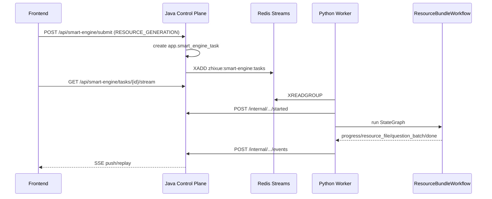
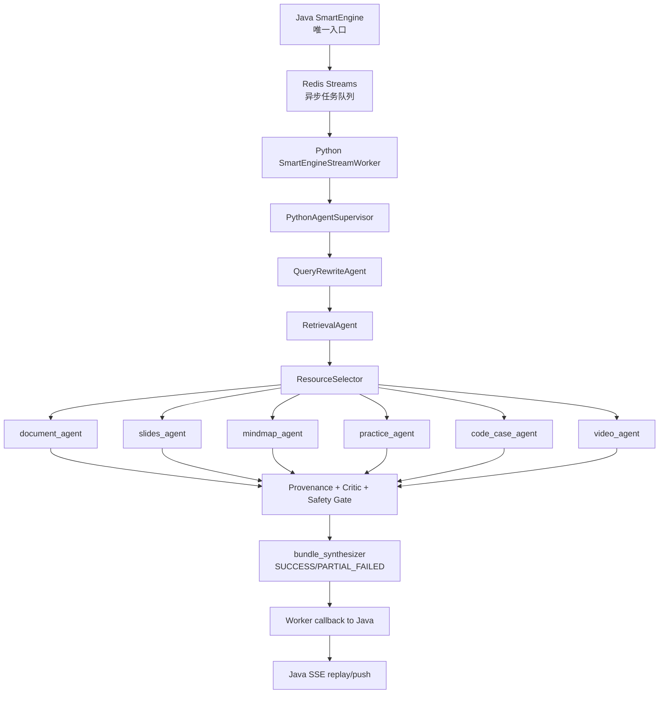

# Graph 多智能体资源包架构说明

更新日期：2026-06-03

## 目标边界

当前 Graph 多智能体改造只针对 `RESOURCE_GENERATION`。它不替换 Java 唯一入口、Redis Streams 长任务队列、SSE 协议、下载签名机制，也不把所有业务路由都宣称为 Graph。

硬边界：

- `RESOURCE_GENERATION` 路由固定为 `query_rewrite -> retrieval -> resource_bundle`。
- `resource_bundle` 是虚拟节点，由 `ResourceBundleWorkflow` 的 LangGraph `StateGraph` 执行。
- 没有真实 LLM 输出，不能发布生成资源。
- LLM key 缺失、模型不可用、结构化输出校验失败时，任务失败或资源项失败，不返回模板文档、模板题、规则总结冒充产物。
- 规则只用于检索、过滤、格式校验、安全拦截和事实检查，不能作为主要内容生成。
- 可发布资源必须携带 `generatedBy=LLM`、`contentOrigin=LLM`、`provider`、`model`、`agentName`、`evidenceIds`、`fallback=false`、`fromCache`。
- 前端实时 SSE 和轮询/刷新快照收到缺失 provenance 的生成资源时都不展示资源卡片，只展示失败提示。

参考架构来源：

- LangChain multi-agent：上下文隔离、并行化、专门职责和顺序约束。
- LangGraph：低层级、有状态、长任务 Agent 编排运行时。
- Deep Agents：coordinator-worker、规划、子 Agent 隔离和文件/记忆能力。本项目未引入 `deepagents` 依赖，只吸收其协作思想。

## 当前生产路径

SmartEngine 长任务入口已经是异步队列路径：



旧兼容流式端点 `/internal/smart-engine/stream` 仍存在，主要用于对话流和内部兼容调用；资源生成任务的标准路径是 Redis Streams Worker。

## 和旧资源生成路径的差异

旧路径：

1. Java 通过 SmartEngine 提交任务。
2. Python `PythonAgentSupervisor.resolve_route()` 根据 `resourceType` 选择单个生成 Agent。
3. 路由通常是 `query_rewrite -> retrieval -> document_generator/slide_generator/...`。
4. 单个生成 Agent 自己产出 `resource_file`。

当前路径：

1. Java 入口不变。
2. `RESOURCE_GENERATION` 路由固定为 `query_rewrite -> retrieval -> resource_bundle`。
3. `resource_bundle` 由 `ResourceBundleWorkflow` 的 LangGraph `StateGraph` 执行。
4. Graph 内部有显式 `document_agent`、`slides_agent`、`mindmap_agent`、`practice_agent`、`code_case_agent`、`video_agent` 等节点。
5. Graph 中 `query_rewrite`、`retrieval` 串行执行，确保检索使用改写后的 query。
6. Graph 中资源 Agent 按用户选择的 `resourceTypes[]` 并发 fan-out；选择 1 个或多个都可以，后端不自动补齐资源类型。
7. 未传 `resourceTypes/resourceType` 时仅沿用旧默认讲解文档 `DOCUMENT`。
8. `QueryRewriteAgent` 优先使用 LLM 改写；LLM 429/异常或结构校验失败时允许退回本地 direct rewrite，避免资源生成在改写阶段直接失败。
9. 所有资源事件先过 provenance gate，缺字段、`contentOrigin != LLM`、`fallback != false` 或缺 `fromCache` 直接失败，不发布资源。
10. Graph 全失败时只发 `error` + `done(status=FAILED)`；部分资源失败但至少一个真实生成成功时发布成功资源并以 `done(status=PARTIAL_FAILED)` 列出失败资源。
11. Java 对 `resource_file`、`question_batch` 和携带脚本/音频/视频素材的 `video_gen:*` 做二次 provenance 校验，校验失败改写为 `error(PROVENANCE_INVALID)`，不签发下载链接。

## 当前结论

- 真正 Graph 化的是 `RESOURCE_GENERATION`，不能把整个系统说成“所有服务都已 Graph 化”。
- `PERSONALIZED_LEARNING` 已是 Supervisor 顺序多智能体路由：`profile -> evaluation -> query_rewrite -> retrieval -> path_planning -> resource_push -> critic`，但它不是 LangGraph `resource_bundle` 这类 Graph fan-out。
- 其他服务仍主要是 Supervisor 顺序路由或单 Agent 内部工作流：`TUTORING`、`VIDEO_GENERATION`、`PRACTICE_JUDGE`、`PATH_PLANNING`、`EVALUATION`。
- 当前 Supervisor 注册 18 个真实 Agent；`resource_bundle` 是虚拟 Graph 节点，不算单独 Agent 类。
- 无伪生成边界强约束在“可发布生成资源”上：`resource_file`、`question_batch`、携带脚本/音频/视频素材的 `video_gen:*` 必须带 LLM provenance。
- `CriticAgent` / `SafetyAgent` 的规则 fallback 只作为审核信号，不作为主要资源内容发布。
- Profile/Judge/PathPlanning 中仍可能存在存储降级或规则辅助逻辑，答辩时应明确它们不是“生成资源 provenance gate”的覆盖范围。

## Graph 结构



## Agent 职责

`RouterAgent`

当前由 `PythonAgentSupervisor.resolve_route()` 承担。它决定任务进入资源包、视频、辅导、评估、路径规划等路径。

`QueryRewriteAgent`

负责 LLM 查询改写和关键词提取。Graph 中它必须先于检索执行；`RESOURCE_GENERATION` 下 LLM 改写失败时允许退回本地 direct rewrite。

`RetrievalAgent`

负责真实知识库和 Web 证据检索。无命中返回空文档列表，不再产生 `fallback-*` 假来源。

`DocumentAgent`

调用 `ResourceGenerationService` 和 `ContentGenerationChain` 生成讲解文档。产物必须来自 LLM，并由质量门复核。

`SlidesAgent`

生成 PPT 或 PPT 大纲。若 PPTX 专用模型不可用，可以走另一个真实 LLM 生成 Markdown 大纲，但不能用模板 PPT 伪装。

`MindMapAgent`

生成 Mermaid 思维导图。Mermaid 格式修复是规则处理，核心节点内容必须来自 LLM。

`PracticeAgent`

生成练习题。静态题目模板 fallback 已移除；题目生成失败时抛出明确错误。

`CodeCaseAgent`

生成代码实操案例。规则只能用于格式化代码块、语言标识和安全检查。

`VideoAgent`

负责视频脚本、TTS、浏览器渲染素材链路。脚本必须由 LLM 生成；TTS 或素材生成失败会明确失败。

`CriticAgent`

检查事实支撑、难度匹配和引用覆盖。规则 fallback 只作为审核信号，不作为主要资源内容发布。

`SafetyAgent`

检查内容安全、学术诚信和违规风险。规则 fallback 只用于拦截和风险判断。

`BundleSynthesizerAgent`

当前由 `ResourceBundleWorkflow` 的汇总逻辑承担：只把已通过 provenance gate 的 `resource_file` 和 `question_batch` 汇总到 `generatedAssets`。

## 关键代码位置

- Graph 编排：`python-agent/src/ai_modules/runtime/resource_bundle_workflow.py`
- Supervisor 接入：`python-agent/src/ai_modules/supervisor.py`
- 路由模板：`python-agent/src/ai_modules/supervisor_routes.json`
- provenance 规则：`python-agent/src/ai_modules/runtime/provenance.py`
- Redis Streams Worker：`python-agent/src/ai_modules/runtime/smart_engine_stream_worker.py`
- Query rewrite LLM 优先与 direct fallback：`python-agent/src/ai_modules/agents/query_rewrite_agent.py`
- 生成 Agent：`python-agent/src/ai_modules/agents/generation/generators.py`
- SSE 事件模型：`python-agent/src/ai_modules/models/events.py`
- Java 队列生产者：`project/src/main/java/com/project/application/smartengine/SmartEngineQueueService.java`
- Java 状态机与 provenance 二次校验：`project/src/main/java/com/project/application/smartengine/TaskStateMachineService.java`
- Java SSE 重放：`project/src/main/java/com/project/application/smartengine/SseEmitterService.java`
- 前端 provenance 拦截：`frontend/src/pages/LearningStudioDemoPage.utils.ts`

## 验证口径

已覆盖或应持续覆盖：

- LLM 不可用时资源包失败，且不发布 `resource_file` / `question_batch`。
- `RESOURCE_GENERATION` 下 query rewrite LLM 失败时退回本地 direct rewrite，任务继续进入检索与资源生成。
- `resourceTypes[]` 会按用户选择的任意数量 fan-out 到对应显式 Graph 资源节点。
- 单个资源 Agent 失败但其他资源真实生成成功时返回 `PARTIAL_FAILED`。
- 所有发布资源必须带完整 LLM provenance。
- `PracticeAgent` LLM 失败时不返回模板题。
- 前端实时 SSE 与任务快照恢复路径都拒绝缺 provenance 的生成资源。
- Java 对缺 provenance 的生成资源拒绝落库为成功资源并拒绝签发下载链接。
- SSE event 类型不变，只扩展 payload 字段。
- 检索无结果不伪造 fallback 文档。

建议命令：

```bash
cd python-agent
pytest tests/test_resource_bundle_workflow.py tests/test_supervisor.py tests/test_contract_validation.py -q

cd project
mvn -q "-Dtest=SseEventContractValidationTest,TaskStateMachineProvenanceTest" test

cd frontend
npx tsc --noEmit
npx vite build
```
