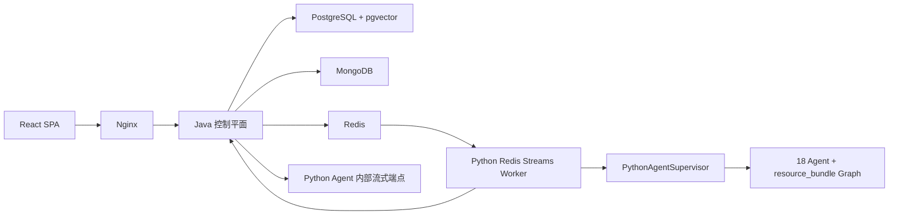

# 智学引擎 (ZhiXue Engine) — 项目技术报告

> 作者：张志鹏
> 最后更新：2026-06-03

## 一、项目定位

智学引擎面向计算机专业学习场景，目标是把“问答辅导、资源生成、练习评测、错题复习、学习画像、个性化学习方案、学习效果评估闭环”组织成一套可运行的个性化学习系统，而不是单次 LLM 调用演示。

当前系统的工程原则：

- Java 控制平面是唯一外部 API 入口。
- Python Agent 只暴露内部接口和健康检查。
- 长任务通过 Redis Streams 解耦，前端只订阅 Java SSE。
- 生成型内容必须有 LLM provenance，规则逻辑不能冒充生成资源。
- 当前联调/演示环境只允许 `docker cp` 热更新，不重建容器。

## 二、参考资料与设计来源

| 来源 | 本项目对应模块 | 借鉴点 |
|---|---|---|
| Karpathy LLM Wiki 与中文技术知识库实践 | RAG 检索 | grep + vector + graph 的混合检索、RRF 融合、中文术语字面匹配优先 |
| DH_live 浏览器端数字人 | 视频生成 | WASM 静态资源、浏览器端数字人渲染、postMessage 驱动 |
| Claude Code Agent 运行时理念 | Agent Runtime | AgentCoreLoop、ToolRegistry、HookChain、PermissionPolicy、RecoveryEngine、ConversationCompactor |
| LangGraph / LangChain multi-agent | ResourceBundleWorkflow | 有状态图编排、custom stream、coordinator-worker、多资源 fan-out |

本项目在上述基础上做了教育场景约束：学习画像、错题复习、学习效果诊断、个性化路径规划、资源 provenance、Java 控制平面状态机。

## 三、核心功能

### 3.1 智能问答

入口：前端 `/`。

能力：

- 多轮文字问答。
- 图片上传后进入图片题链路。
- 深度推理开关触发分步推理 Agent。
- 可选联网搜索。
- SSE 逐字渲染。
- Markdown、代码块、Mermaid、表格渲染。
- 对话消息写入 MongoDB，Java 维护 QNA session 元数据。

问答链路由 QueryClassifier 动态选择：

| 输入类型 | 链路 |
|---|---|
| 寒暄 / 追问 / 回答上一题 | `tutor` |
| 普通知识问题 | `query_rewrite -> retrieval -> tutor` |
| 图片题 | `image_analysis -> query_rewrite -> retrieval -> tutor` |
| 深度推理 | `query_rewrite -> retrieval -> image_analysis -> deep_reasoning` |
| 低置信分类 | `query_rewrite -> retrieval -> tutor` |

### 3.2 SmartEngine 长任务

入口：前端 `/engine`。

Java 创建任务后写入 `app.smart_engine_task`，再通过 Redis Streams 派发：

1. `POST /api/smart-engine/submit`
2. Java 创建 `PENDING` 任务，处理 idempotency key。
3. Java `XADD zhixue:smart-engine:tasks`。
4. Python `SmartEngineStreamWorker` 通过 consumer group 消费。
5. Worker 调用 Supervisor 执行任务。
6. Worker 回调 Java `/internal/smart-engine/tasks/{taskId}/events`。
7. Java 持久化 `app.smart_engine_task_event` 并向订阅者推送 SSE。
8. 前端可断线重连，Java 从任务事件表重放。

任务状态：

`PENDING -> RUNNING -> COMPLETED | FAILED | CANCELLED | TIMEOUT`

### 3.3 资源生成

`RESOURCE_GENERATION` 当前是 LangGraph 资源包：

- 固定外层路由：`query_rewrite -> retrieval -> resource_bundle`。
- `resource_bundle` 内部按 `resourceTypes[]` 并发 fan-out。
- 未传资源类型时只默认 `DOCUMENT`。
- 资源类型可覆盖文档、PPT、思维导图、代码案例、练习题、视频等。
- 任一资源失败不会伪造模板资源；至少一个真实资源成功时任务可 `PARTIAL_FAILED`。

可发布生成资源必须携带：

`generatedBy=LLM`、`contentOrigin=LLM`、`provider`、`model`、`agentName`、`evidenceIds`、`fallback=false`、`fromCache`。

Python 生成出口、Java 状态机、前端结果恢复都会校验这些字段。

### 3.4 练习与评测

`PRACTICE_JUDGE` 链路为：

`practice -> judge -> profile`

流程：

1. PracticeAgent 生成题目。
2. 前端展示作答。
3. JudgeAgent 批改客观题和主观题。
4. 结果写入练习存储。
5. ProfileAgent 更新学习画像。
6. 错题进入错题本复习流程。

`EVALUATION` / `LEARNING_EVALUATION` 链路为 `evaluation`。当前主口径不是孤立报告生成，而是在个性化学习链路中产出 `masteryDiagnosis`：

- 输入来自学习行为、练习测试、错题复习、资源使用反馈和画像弱项。
- 输出包含知识点级诊断、行为信号、薄弱项优先级、推荐资源类型和计划调整建议。
- `PathPlanningAgent` 和 `ResourcePushAgent` 消费该诊断，动态调整学习步骤和资源推送策略。
- 旧评估服务类型保留为兼容入口，评委演示主入口使用 `PERSONALIZED_LEARNING`。

### 3.5 个性化学习方案

入口：前端 `/engine` 中的“个性化学习方案”。

`PERSONALIZED_LEARNING` 是路径规划、学习效果评估和资源推送的主业务入口，真实路由为：

```text
profile -> evaluation -> query_rewrite -> retrieval -> path_planning -> resource_push -> critic
```

链路特征：

- Java `PersonalizedLearningContextService` 在提交前聚合学生专业、学习进度、画像、知识掌握图谱、练习测试、错题复习和资源反馈。
- `ProfileAgent` 和 `EvaluationAgent` 生成画像分析与 `masteryDiagnosis`。
- `QueryRewriteAgent` 与 `RetrievalAgent` 将薄弱知识点、学习目标和检索证据传给路径规划。
- `PathPlanningAgent` 输出有顺序的学习步骤、目标知识点、前置依赖、检查点和预计时长。
- `ResourcePushAgent` 按路径步骤推荐文档、视频、题库、实操案例等资源。
- `CriticAgent` 审查路径顺序、资源覆盖和个性化匹配度，审查结果保留在任务状态和日志数据中。

`PATH_PLANNING`、`RESOURCE_PUSH` 可作为内部服务或高级调试入口保留，但不再作为评委演示主入口。

### 3.6 错题本

入口：前端 `/mistakes`。

能力：

- 今日复习优先。
- 错题状态筛选。
- 复习会话一题一屏。
- 四档掌握判断。
- SM-2 间隔重复调度。

Java 对外 API 位于 `/api/mistakes/*`。

### 3.7 学习画像

入口：前端 `/profile`。

画像规则集中在 `python-agent/src/ai_modules/memory/profile_feature_registry.py`，当前包含 14 个维度，支持：

- 单例维度。
- canonical key 维度。
- 置信度衰减。
- `ACTIVE / RESOLVED / REGRESSED / ARCHIVED` 生命周期。
- 向量化画像用于相似用户匹配。

前端画像 API：

- `GET /api/users/{userId}/profile/current`
- `GET /api/users/{userId}/profile/analytics`
- `GET /api/users/{userId}/knowledge-graph`

知识掌握图谱由 `LearnerKnowledgeGraphService` 聚合画像、评估、练习和任务证据。当前展示按主题归并重复知识点，顶部保留 3 个“下一步优先关注”，其余知识点以状态数量和紧凑列表展示，避免大面积重复卡片影响学生提取重点。

## 四、技术架构

### 4.1 总体架构



### 4.2 Java 控制平面

核心职责：

- JWT 登录、注册、鉴权。
- CORS、IP 限流、用户限流。
- SmartEngine 任务创建、取消、状态查询。
- Redis Streams producer。
- Python Worker 回调校验和事件落库。
- SSE 推送和事件重放。
- 生成资源签名下载。
- 错题本和画像查询。

关键类：

| 类 | 职责 |
|---|---|
| `SmartEngineOrchestratorService` | 任务提交、订阅、取消、Worker 回调入口 |
| `SmartEngineQueueService` | Redis Streams producer |
| `TaskStateMachineService` | 状态流转、事件持久化、provenance 二次校验 |
| `SseEmitterService` | 多订阅者推送和历史事件重放 |
| `ConversationService` | 对话流式转发和会话消息写入 |
| `ArtifactDownloadService` | 下载 token 签名和过期控制 |

### 4.3 Python Agent

核心模块：

| 模块 | 职责 |
|---|---|
| `server.py` | FastAPI 入口、内部鉴权、健康检查、sandbox 清理、Worker 启动 |
| `supervisor.py` | 服务路由、Agent 执行、Critic 复核编排 |
| `supervisor_routes.json` | serviceType 到 Agent 链路映射 |
| `runtime/resource_bundle_workflow.py` | LangGraph 资源包 |
| `runtime/agent_core_loop.py` | 工具调用循环 |
| `runtime/tool_registry.py` | 工具 schema 和注册 |
| `runtime/hook_chain.py` | 工具前后钩子 |
| `runtime/permission_policy.py` | 工具权限 |
| `runtime/smart_engine_stream_worker.py` | Redis Streams 消费、Java 回调 |
| `retrieval/services.py` | RAG 服务适配 |
| `memory/*` | 会话、计划、练习、画像存储 |

当前 Supervisor 注册 18 个真实 Agent：

`query_rewrite`、`retrieval`、`document_generator`、`slide_generator`、`reading_generator`、`mindmap_generator`、`code_generator`、`video_generator`、`deep_reasoning`、`tutor`、`profile`、`practice`、`judge`、`path_planning`、`evaluation`、`image_analysis`、`resource_push`、`critic`。

### 4.4 前端

核心模块：

| 模块 | 职责 |
|---|---|
| `App.tsx` | 路由定义 |
| `Layout.tsx` | 侧边栏、移动导航、主题切换 |
| `LearningStudioDemoPage*` | 问答和引擎主页面 |
| `useLearningStudioQna.ts` | 对话流状态管理 |
| `useLearningStudioEngine.ts` | SmartEngine 任务状态管理 |
| `MarkdownRenderer.tsx` | Markdown/GFM/代码/Mermaid 渲染 |
| `browserVideoRenderer.ts` | DH Live 浏览器端视频渲染 |

## 五、RAG 检索

### 5.1 数据来源

`wiki/*.md` 经导入和向量化后写入：

- `rag.wiki_page`
- `rag.wiki_link`
- `rag.term_lexicon`
- `rag.synonym_group`
- `rag.knowledge_document`
- `rag.knowledge_chunk`

向量维度固定为 1024，初始化数据由 `vector_data.dump` 恢复。

### 5.2 检索通道

| 通道 | 用途 |
|---|---|
| grep | 中文技术术语、缩写、精确概念优先 |
| vector | 语义召回 |
| graph | wiki link、共同标签、社区结构扩展 |
| web | Tavily 可选联网补充 |

结果通过 RRF 融合。缓存必须有 TTL，避免检索结果长期污染。

### 5.3 当前报告指标

| 报告 | 指标 |
|---|---|
| `python-agent/reports/rag_100_after.json` | 基础 100 题 hit@3 98%，success 99/100 |
| `python-agent/reports/graph_rag_100_current.json` | 图谱型 100 题 hit@3 94%，partialEvidenceTop5 100%，completeEvidenceTop5 52% |

验收命令仍以 `pytest python-agent/tests/ -k rag -v` 为准，AGENTS 要求 hits@3 >= 90%。

## 六、SSE 协议

契约文件：`contracts/sse-events.schema.json`。

事件类型：

```text
message
progress
result_chunk
resource_file
question_batch
judge_result
done
error
video_gen:start
video_gen:script
video_gen:speech
video_gen:avatar
video_gen:complete
```

统一字段：

- `event`
- `taskId`
- `traceId`
- `seq`
- `payload`
- `dialogState`

Java `SseEmitterService` 会将任务事件持久化并按 `seq` 重放；前端收到缺失 provenance 的生成资源时拒绝展示。

## 七、安全与可靠性

| 风险 | 机制 |
|---|---|
| 未授权访问 | JWT + Spring Security |
| 内部接口误用 | `X-Zhixue-Internal-Token` |
| 重复提交 | Redis idempotency `SETNX + TTL` |
| 请求过载 | IP 限流 + 用户限流 |
| 长任务断线 | Redis Streams + Java 事件重放 |
| 生成资源伪造 | Python/Java/前端 provenance gate |
| 下载泄露 | 签名 token + 过期时间 |
| sandbox 堆积 | Python 30 分钟清理一次，删除 2 小时前文件 |
| SSE 被代理缓冲 | Nginx `proxy_buffering off` 和 `X-Accel-Buffering no` |

## 八、部署方式

### 8.1 全新部署

```bash
cp .env.example .env
docker compose up -d --build
docker compose ps
curl -s http://localhost:8081/api/health
curl -s http://localhost:8000/health
```

### 8.2 本地 Judge 可选模式

`docker-compose.local-judge.yml` 覆盖 Python Agent：

- 安装本地 judge 依赖。
- 挂载 `./models` 到 `/app/models`。
- 设置 `ENABLE_LOCAL_JUDGE=true`。
- 单 worker 避免重复加载模型。

### 8.3 热更新环境

当前联调/演示环境禁止 build/recreate，只允许：

- 前端：本地 `npx tsc --noEmit && npx vite build` 后 `docker cp dist/.` 到 Nginx html 目录并 reload。
- Python：复制变更 `.py` / skill 文件到容器同路径，容器内 `py_compile` 后 HUP 或重启现有容器。
- Java：本地打包 jar，复制到 `zhixue-app:/app/app.jar`，重启现有 app 容器。

## 九、测试覆盖

常用验证：

```bash
docker compose ps
curl -s http://localhost:8081/api/health
curl -s http://localhost:8000/health
cd frontend && npx tsc --noEmit && npx vite build
cd project && mvn test
cd python-agent && pytest tests/ -v
cd python-agent && pytest tests/ -k rag -v
```

重点测试文件：

- Java：`SseEventContractValidationTest`、`TaskStateMachineProvenanceTest`、`ConversationServiceClientDisconnectTest`、`RateLimitIntegrationTest`。
- Python：`test_resource_bundle_workflow.py`、`test_supervisor.py`、`test_smart_engine_stream_worker.py`、`test_contract_validation.py`、`test_retrieval_services.py`、`test_graph_rag_question_set.py`。
- 前端：TypeScript 编译、Vite 构建和 `tests/` 下端到端脚本。

## 十、创新点

- Java 控制平面和 Python Agent 分工明确，既保留 Java 唯一入口，又让 Python 专注 AI 运行时。
- Redis Streams 把长任务从 HTTP 请求生命周期中解耦，前端靠 Java SSE 重放恢复。
- ResourceBundleWorkflow 把资源生成升级为 LangGraph 多 Agent fan-out，并保留可部分失败的任务语义。
- 生成资源使用跨层 provenance gate，减少模板/规则内容伪装为 LLM 产物的风险。
- RAG 同时结合中文术语 grep、向量、图谱和 Web，报告指标稳定高于 90% hit@3 目标。
- 学习画像采用 registry 化维度规则，支持衰减、canonical 合并和生命周期管理。
