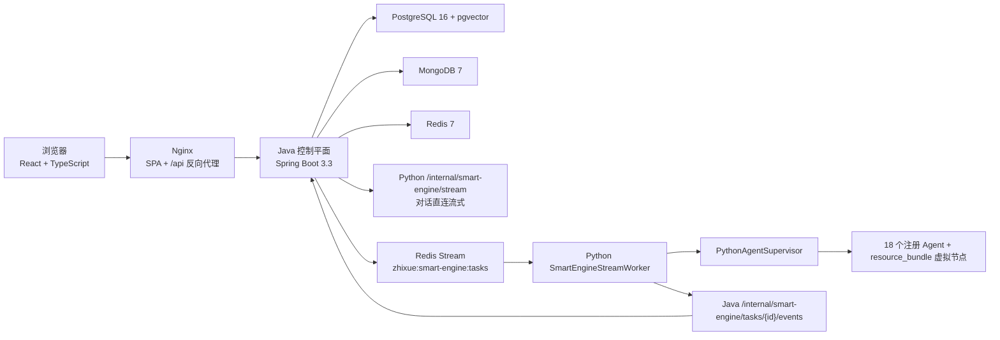
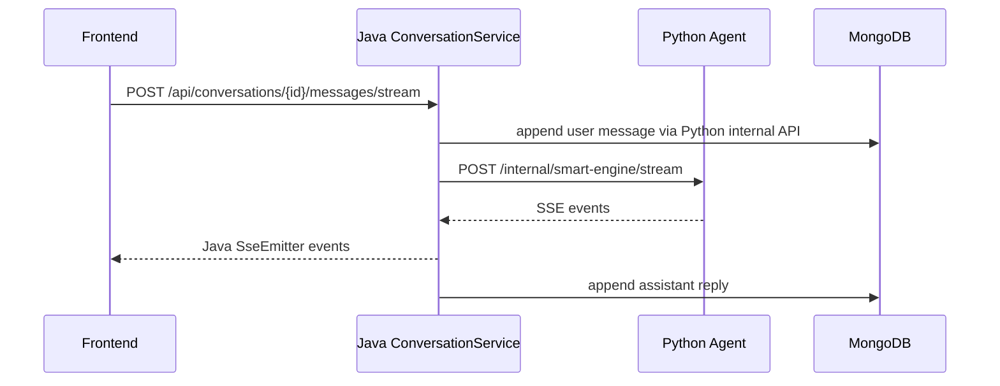
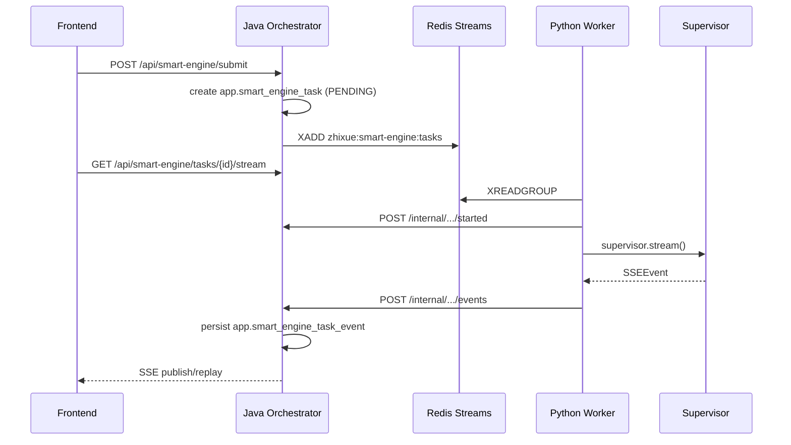
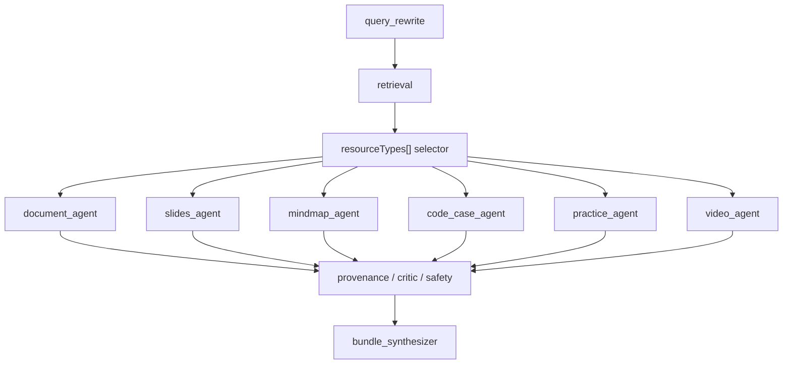

# 智学引擎 (ZhiXue Engine) — 系统架构文档

> 最后更新：2026-05-31

## 一、架构总览

智学引擎采用 **前端 SPA + Java 控制平面 + Python Agent 运行时 + 数据层** 的分层架构。当前 Docker Compose 标准栈包含 6 个服务：`frontend`、`app`、`python-agent`、`postgres`、`mongo`、`redis`。

关键边界：

- Java 是浏览器业务 API 的唯一入口；浏览器不直接调用 Python Agent 内部接口。
- Python Agent 暴露 `/health` 和 `/internal/*`，内部接口必须带 `X-Zhixue-Internal-Token`。
- 对话流是 Java 直接调用 Python 内部 SSE 端点并转发给前端。
- SmartEngine 长任务是 Java 入队 Redis Streams，Python Worker 消费任务并回调 Java，Java 持久化事件后向前端 SSE 推送/重放。
- SSE wire format 固定为 `event:` / `data:`，不能改协议前缀。



### 技术栈速查

| 层 | 技术 | 端口 | 说明 |
|---|---|---|---|
| 前端 | React 18、TypeScript 5.6、Vite 5、Tailwind CSS 4、Nginx | 80 | SPA 和 API/SSE 反向代理 |
| Java 控制平面 | Java 21、Spring Boot 3.3.12、Spring Security、JPA、Mongo、Redis | 8081 | 认证、任务、状态机、SSE、下载签名 |
| Python Agent | Python 3.11、FastAPI、LangGraph、LangChain、SSE-Starlette | 8000 | Supervisor、Agent、RAG、资源生成、Worker |
| PostgreSQL | pgvector/pgvector:pg16 | 5432 | `app`、`rag`、`storage` schema |
| MongoDB | MongoDB 7 | 27017 | 会话线程、消息、流事件 |
| Redis | Redis 7 Alpine | 6379 | 限流、幂等、缓存、Streams、取消标记 |

## 二、部署拓扑

### 2.1 Docker Compose 服务

| Compose 服务 | 容器 | 依赖 | 主要职责 |
|---|---|---|---|
| `frontend` | `zhixue-frontend` | `app` | 静态资源、SPA fallback、`/api` 和 SSE 反代 |
| `app` | `zhixue-app` | Postgres、Mongo、Redis、Python | Java 控制平面和唯一外部 API |
| `python-agent` | `zhixue-python-agent` | Postgres、Mongo、Redis | FastAPI 内部接口和 SmartEngine Worker |
| `postgres` | `zhixue-postgres` | 无 | 业务库、RAG 向量库、初始化脚本 |
| `mongo` | `zhixue-mongo` | 无 | 会话文档库 |
| `redis` | `zhixue-redis` | 无 | AOF 缓存/队列 |

数据目录：

- `./data/postgres`
- `./data/mongo`
- `./data/redis`
- `./data/logs`
- `./data/sandbox-temp`

首次启动执行：

- `init.sql`：创建 PostgreSQL schema、表、索引、触发器。
- `restore_vector_data.sh`：恢复 `vector_data.dump` 中的预置向量数据。
- `mongo-init.js`：创建 MongoDB collection、校验规则和索引。

### 2.2 热更新边界

当前联调/演示环境只允许 `docker cp` 热更新，禁止：

- `docker compose build`
- `docker compose up --build`
- `docker compose up --force-recreate`
- 重建容器或变更 Compose 拓扑

全新空环境或维护窗口才允许执行 build/recreate 类命令。

## 三、前端架构

### 3.1 路由

当前前端路由由 `frontend/src/App.tsx` 定义：

| 路由 | 页面 |
|---|---|
| `/` | `LearningStudioDemoPage mode="qna"`，智能问答 |
| `/engine` | `LearningStudioDemoPage mode="engine"`，SmartEngine 服务 |
| `/mistakes` | `MistakeBookPage`，错题本 |
| `/profile` | `ProfilePage`，学习画像 |
| `*` | 重定向 `/` |

### 3.2 API 层

| 文件 | 职责 |
|---|---|
| `src/api/request.ts` | Axios 实例、JWT header、错误归一、请求去重/重试 |
| `src/api/sse.ts` | 基于 `fetch + ReadableStream` 的 SSE 解析 |
| `src/api/auth.ts` | 登录、注册、退出、当前用户 |
| `src/api/conversation.ts` | 会话创建、历史、消息流、图片上传 |
| `src/api/smartEngine.ts` | 任务提交、任务状态、任务 SSE、画像 API |
| `src/api/mistakes.ts` | 错题列表、复习会话、提交复习 |

前端不使用原生 `EventSource`，因为对话流和任务流都需要携带 JWT/自定义请求信息；当前统一走 `fetch` 流式读取。

### 3.3 Nginx

`frontend/nginx.conf` 的关键配置：

- `/api/` 代理到 `app:8081`。
- `/api/smart-engine/tasks/{id}/stream` 和 `/api/conversations/{id}/messages/stream` 关闭缓冲。
- SSE 读取超时为 1800 秒。
- 普通 API 超时为 600 秒。
- `client_max_body_size 50M` 支持图片上传。

## 四、Java 控制平面

### 4.1 包结构

| 包 | 职责 |
|---|---|
| `api` | REST Controller 和 DTO |
| `application` | 用例服务、状态机、限流、幂等、审计、下载签名 |
| `domain` | JPA Entity、Repository、枚举 |
| `infrastructure` | Python HTTP 客户端、限流 Filter |
| `config` | 安全、CORS、Redis、任务线程池、配置属性 |
| `security` | JWT、internal token、当前用户解析 |

### 4.2 对外 API

| Controller | 路径 |
|---|---|
| `ApiHealthController` | `GET /api/health` |
| `AuthController` | `/api/auth/*` |
| `ConversationController` | `/api/conversations/*` |
| `SmartEngineController` | `/api/smart-engine/*` |
| `SmartEngineInternalController` | `/internal/smart-engine/tasks/{taskId}/*` |
| `ArtifactController` | `/api/assets/download/{token}` |
| `MistakeBookController` | `/api/mistakes/*` |
| `UserController` | `/api/users/{userId}/profile/*` |

### 4.3 安全链

`SecurityConfiguration` 采用无状态 JWT：

- 公开：`/api/health`、`/actuator/health`、OpenAPI、Swagger、登录注册、图片临时访问、`/internal/**`。
- 业务 API 默认鉴权。
- Filter 顺序：IP 限流 → JWT 认证 → 用户限流。
- `/internal/**` 在 Spring Security 层放行，但 Controller 内部用 `InternalTokenVerifier` 校验共享 token。

### 4.4 对话流路径



对话使用 `conversationTaskExecutor` 后台执行；Java 会收集 `result_chunk` 中面向用户的文本并写回 MongoDB。

### 4.5 SmartEngine 长任务路径



状态机：

`PENDING -> RUNNING -> COMPLETED | FAILED | CANCELLED | TIMEOUT`

事件重放由 `SseEmitterService` 从 `app.smart_engine_task_event` 按 `event_seq` 读取，支持前端断线重连后恢复。

### 4.6 任务可靠性

- 幂等：`RedisIdempotencyService` 使用 `SETNX + TTL`。
- 取消：Java 写 Redis cancel key，并通知 Python `/internal/smart-engine/{taskId}/cancel`。
- Worker 回调：`started`、`events`、`worker-failed` 都要求 internal token。
- 生成资源：Java 二次校验 provenance，不合格资源改写为 `PROVENANCE_INVALID` 错误，不签发下载链接。

## 五、Python Agent 架构

### 5.1 FastAPI 入口

`python-agent/server.py` 提供：

| 路径 | 用途 |
|---|---|
| `GET /health` | 健康检查，返回 provider/model 解析信息 |
| `POST /internal/smart-engine/stream` | 内部流式执行 |
| `POST /internal/smart-engine/{task_id}/cancel` | 文件标记 + active task cancel |
| `POST /internal/conversations/{conversation_id}/messages` | 写会话消息 |
| `GET /internal/conversations/{conversation_id}/messages` | 查会话消息 |

应用启动时会创建：

- sandbox 清理循环：30 分钟检查一次，删除超过 2 小时的 sandbox 文件。
- `SmartEngineStreamWorker`：消费 Redis Streams 长任务。

### 5.2 Supervisor

`PythonAgentSupervisor` 当前注册 18 个真实 Agent：

```text
query_rewrite, retrieval, document_generator, slide_generator,
reading_generator, mindmap_generator, code_generator, video_generator,
deep_reasoning, tutor, profile, practice, judge, path_planning,
evaluation, image_analysis, resource_push, critic
```

`resource_bundle` 不是注册类名，而是 `RESOURCE_GENERATION` 路由中的虚拟节点，由 `ResourceBundleWorkflow` 执行。

### 5.3 服务路由

| serviceType | route |
|---|---|
| `PROFILE_BUILD` | `tutor -> profile` |
| `RESOURCE_GENERATION` | `query_rewrite -> retrieval -> resource_bundle` |
| `RESOURCE_PUSH` | `resource_push` |
| `VIDEO_GENERATION` | `query_rewrite -> retrieval -> video_generator` |
| `PRACTICE_JUDGE` | `practice -> judge -> profile` |
| `PATH_PLANNING` | `path_planning` |
| `EVALUATION` / `LEARNING_EVALUATION` | `evaluation` |
| `TUTORING` | QueryClassifier 动态选择 |

`TUTORING` 动态分支：

- 小聊、追问、回答上一题：`tutor`
- 普通问题：`query_rewrite -> retrieval -> tutor`
- 图片题：`image_analysis -> query_rewrite -> retrieval -> tutor`
- 深度推理：`query_rewrite -> retrieval -> image_analysis -> deep_reasoning`
- 低置信分类：`query_rewrite -> retrieval -> tutor`

### 5.4 ResourceBundleWorkflow

资源生成当前使用 LangGraph `StateGraph.astream(..., stream_mode=["updates", "custom"])`：



行为：

- 按用户选择的 `resourceTypes[]` fan-out；未传时仅默认 `DOCUMENT`。
- 子 Agent 事件实时透传。
- 全失败：`error` + `done(status=FAILED)`。
- 部分失败：成功资源照常发布，最终 `done(status=PARTIAL_FAILED)` 带 `resourceFailures`。
- 可发布资源必须通过 provenance gate。

### 5.5 RAG 检索

当前 RAG 是四通道融合：

| 通道 | 说明 |
|---|---|
| grep | FMM/术语词典辅助的短语和关键词命中 |
| vector | DashScope/OpenAI-compatible embedding + pgvector |
| graph | `rag.wiki_link` 和 graph features 扩展关联节点 |
| web | 可选 Tavily 搜索 |

报告口径：

- `python-agent/reports/rag_100_after.json`：基础 100 题 hit@3 98%。
- `python-agent/reports/graph_rag_100_current.json`：图谱型 100 题 hit@3 94%，completeEvidenceTop5 52%。

### 5.6 LLM 配置

Python 配置集中在 `src/ai_modules/config.py`，支持 OpenAI-compatible、MiMo、Spark 等 provider，并提供 14 个组件级覆盖槽：

`query_rewrite_llm`、`retrieval_llm`、`generation_llm`、`practice_llm`、`judge_llm`、`profile_llm`、`tutor_llm`、`conversation_summary_llm`、`planning_llm`、`review_llm`、`safety_llm`、`evaluation_llm`、`path_planning_llm`、`resource_push_llm`。

模型名应通过 `LLMComponentOverride` 或环境配置传入，不在业务代码硬编码。

## 六、数据架构

### 6.1 PostgreSQL

`init.sql` 当前创建三个 schema：

| schema | 主要表 |
|---|---|
| `app` | `users`、`qna_session`、`smart_engine_task`、`smart_engine_task_event`、`generated_artifact`、`user_profile_current`、`learner_feature`、`practice_*`、`audit_log` |
| `rag` | `wiki_page`、`wiki_link`、`wiki_page_graph_features`、`term_lexicon`、`synonym_group`、`knowledge_document`、`knowledge_chunk`、`resource_document`、`resource_chunk`、`user_profile_vector`、`video_generation_task` |
| `storage` | `resource_object` |

向量维度固定为 1024，不可修改。

### 6.2 MongoDB

`mongo-init.js` 创建：

- `conversation_threads`
- `conversation_messages`
- `conversation_stream_events`

`conversation_stream_events.expiresAt` 使用 TTL 索引自动清理。

### 6.3 Redis

主要 key/stream：

| 类型 | 默认值 |
|---|---|
| SmartEngine stream | `zhixue:smart-engine:tasks` |
| SmartEngine DLQ | `zhixue:smart-engine:tasks:dlq` |
| consumer group | `smart-engine-python` |
| cancel prefix | `zhixue:smart-engine:cancel:` |
| idempotency | `idempotency:{userId}:{operation}:{idempotencyKey}` |

## 七、SSE 通信协议

契约文件：`contracts/sse-events.schema.json`。

事件类型：

```text
message
progress
result_chunk
resource_file
question_batch
judge_result
done
error
video_gen:start
video_gen:script
video_gen:speech
video_gen:avatar
video_gen:complete
```

统一 envelope 字段：

- `event`
- `taskId`
- `traceId`
- `seq`
- `payload`
- `dialogState`（可选）

重要约束：

- 不改变 `event:` / `data:` 前缀。
- `seq` 必须单调递增，Java 任务事件以 `event_seq` 去重和重放。
- `done.status` 只能是 `SUCCESS`、`FAILED`、`PARTIAL_FAILED`。
- `resource_file`、`question_batch`、携带视频素材的 `video_gen:*` 必须带 LLM provenance。

## 八、安全架构

| 层 | 机制 |
|---|---|
| 浏览器到 Java | JWT Bearer，CORS 白名单 |
| Java 到 Python | `X-Zhixue-Internal-Token` |
| Python Worker 到 Java | `X-Zhixue-Internal-Token` |
| 下载 | Java 签名 token，默认 1800 秒过期 |
| 限流 | IP 限流 + 用户限流 |
| 幂等 | Redis `SETNX + TTL` |
| 资源发布 | Python/Java/前端三层 provenance gate |
| sandbox | 共享目录 + 周期清理 |

## 九、部署与验证

全新部署：

```bash
cp .env.example .env
docker compose up -d --build
docker compose ps
```

当前联调/演示环境验证：

```bash
docker compose ps
curl -s http://localhost:8081/api/health
curl -s http://localhost:8000/health
cd frontend && npx tsc --noEmit && npx vite build
cd python-agent && pytest tests/ -k rag -v
cd project && mvn test
```

文档和配置一致性：

```bash
docker compose config --quiet
docker compose -f docker-compose.yml -f docker-compose.local-judge.yml config --quiet
git diff --check
```
