# 智学引擎 (ZhiXue Engine) -- 系统架构文档

> 版本：v2.2 | 最后更新：2026-06-21

---

## 目录

- [一、架构设计目标与原则](#一架构设计目标与原则)
- [二、系统架构总览](#二系统架构总览)
- [三、技术选型与理由](#三技术选型与理由)
- [四、前端架构](#四前端架构)
- [五、Java 控制平面](#五java-控制平面)
- [六、Python Agent 运行时架构](#六python-agent-运行时架构)
- [七、多智能体编排](#七多智能体编排)
- [八、数据架构](#八数据架构)
- [九、通信协议](#九通信协议)
- [十、安全架构](#十安全架构)
- [十一、可靠性设计](#十一可靠性设计)
- [十二、可观测性](#十二可观测性)
- [十三、扩展性设计](#十三扩展性设计)
- [附录 A：部署拓扑](#附录-a部署拓扑)
- [附录 B：验证清单](#附录-b验证清单)

---

## 一、架构设计目标与原则

### 1.1 设计目标

智学引擎是一个面向计算机科学教育的 **AI 驱动个性化学习平台**，核心目标是通过多智能体协作，为每位学习者提供自适应的学习路径、智能问答、资源生成和学习效果评估。

| 目标 | 量化指标 |
|---|---|
| 端到端功能完整性 | 全链路测试通过率 100% |
| RAG 检索质量 | 普通 RAG 100 hit@3=100/100；Graph RAG 100 hit@3=94/100，overallPass=true |
| 长任务可靠性 | >5 min 任务不被截断 |
| 流式响应延迟 | 首 token < 2s，逐字渲染 |
| 系统可用性 | 健康检查 200，无 CORS/401 错误 |

### 1.2 架构原则

| 原则 | 说明 |
|---|---|
| **单一入口** | Java 是浏览器唯一 API 入口，Python Agent 为内部服务，杜绝外部直接调用 |
| **关注点分离** | 前端负责渲染、Java 负责编排与持久化、Python 负责 AI 推理与生成 |
| **事件驱动** | 长任务通过 Redis Streams 异步解耦，SSE 实时推送进度 |
| **契约先行** | SSE 事件格式由 JSON Schema 约束，跨层字段一一对应 |
| **幂等优先** | 所有写操作支持幂等键，防止重试导致重复 |
| **可观测** | 全链路 traceId 贯穿，事件可重放，状态可回溯 |
| **渐进扩展** | 新增 Agent 只需注册 + 配置路由，不改动编排框架 |

---

## 二、系统架构总览

### 2.1 分层架构

系统采用 **前端 SPA + Java 控制平面 + Python Agent 运行时 + 数据层** 的四层架构，Docker Compose 编排 6 个服务。

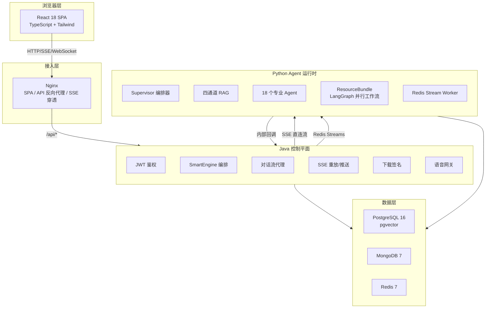

### 2.2 核心架构契约

| 约束 | 说明 |
|---|---|
| Java 是唯一外部入口 | 浏览器不直接调用 Python 内部接口 |
| Python `/internal/*` 需 Token | `X-Zhixue-Internal-Token` 共享密钥 |
| SSE wire format 固定 | `event:` / `data:` 前缀不可变更 |
| 向量维度 1024 | 由 embedding 模型决定，不可修改 |
| 服务端口约定 | 前端 80、Java 8081、Python 8000、PG 5432、Mongo 27017、Redis 6379 |

### 2.3 代码入口索引

| 层 | 关键入口 | 说明 |
|---|---|---|
| 前端路由 | `frontend/src/App.tsx` | React Router 路由表，页面均懒加载到 `Layout` 下 |
| 前端 API | `frontend/src/api/request.ts`、`frontend/src/api/sse.ts` | Axios 请求、JWT 注入、`fetch + ReadableStream` SSE 解析 |
| 前端网关 | `frontend/nginx.conf` | SPA fallback、`/api/*` 反代、SSE/WebSocket 超时策略 |
| Java 启动 | `project/src/main/java/com/project/ProjectApplication.java` | Spring Boot 控制平面入口 |
| Java 配置 | `project/src/main/resources/application.yml` | 端口、数据库、JWT、Python Agent、队列、语音配置 |
| Java 安全 | `project/src/main/java/com/project/config/SecurityConfiguration.java` | JWT、内部 Token、IP/用户限流 Filter 链 |
| Python 启动 | `python-agent/server.py` | FastAPI、内部端点、worker supervisor、sandbox 清理 |
| Agent 编排 | `python-agent/src/ai_modules/supervisor.py`、`supervisor_routes.json` | serviceType 路由、QueryClassifier、Agent 顺序执行 |
| RAG 检索 | `python-agent/src/ai_modules/retrieval/` | QueryClassifier、四路召回、RRF 融合 |
| 事件契约 | `contracts/sse-events.schema.json`、`python-agent/src/ai_modules/models/events.py` | 跨前端/Java/Python 的 SSE 类型与载荷契约 |

### 2.4 双 SSE 通信模式

系统存在两条独立的 SSE 数据通路，分别服务不同场景：

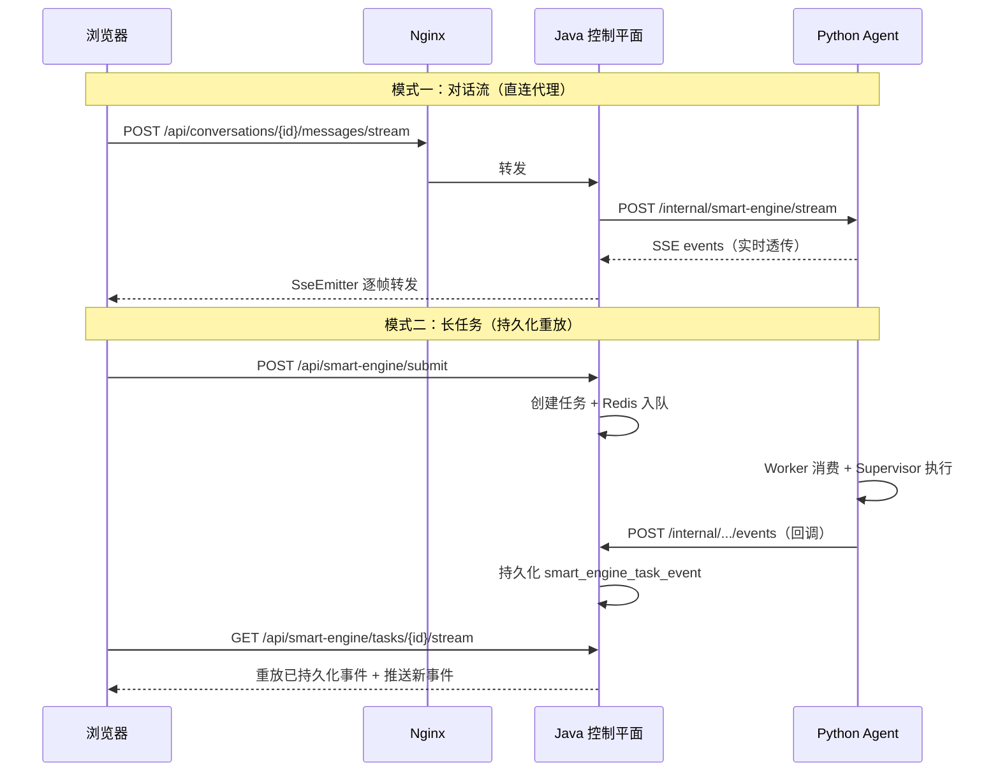

---

## 三、技术选型与理由

### 3.1 前端技术栈

| 技术 | 版本 | 选择理由 |
|---|---|---|
| React | 18 | 组件化开发，生态成熟，Suspense 支持懒加载 |
| TypeScript | 5.6 | 静态类型检查，减少运行时错误，提升协作效率 |
| Vite | 5 | 极速 HMR，ESM 原生支持，构建速度快于 Webpack |
| Tailwind CSS | 4 | 原子化 CSS，零运行时，支持暗色模式 |
| React Router | 7 | 嵌套路由、懒加载、数据加载器 |
| Mermaid | - | 内嵌架构图和流程图渲染 |
| KaTeX | - | 数学公式渲染，支持 LaTeX 语法 |
| Framer Motion | - | 声明式动画，提升交互体验 |

### 3.2 Java 后端技术栈

| 技术 | 版本 | 选择理由 |
|---|---|---|
| Java | 21 | 虚拟线程（Loom）提升并发性能，长期支持版本 |
| Spring Boot | 3.3.12 | 企业级框架，自动配置，生态完善 |
| Spring Security | - | 无状态 JWT 鉴权，Filter 链式安全策略 |
| Spring Data JPA | - | ORM 映射，声明式事务 |
| Spring Data MongoDB | - | 文档数据库集成 |
| Spring Data Redis | - | Streams 操作、缓存、分布式锁 |
| JJWT | 0.12.6 | JWT 签发与验证 |
| SpringDoc OpenAPI | 2.6.0 | 自动 API 文档生成 |

### 3.3 Python Agent 技术栈

| 技术 | 版本 | 选择理由 |
|---|---|---|
| Python | 3.11 | 异步原生支持，AI/ML 生态最丰富 |
| FastAPI | - | 高性能异步框架，自动 OpenAPI 文档 |
| LangGraph | - | 有状态图编排，支持并行 fan-out、条件路由、checkpoint |
| LangChain | - | LLM 抽象层，统一多 provider 接口 |
| SSE-Starlette | - | 服务端事件推送 |
| Pydantic | - | 数据验证和序列化 |
| httpx | - | 异步 HTTP 客户端，支持流式读取 |
| psycopg2 | - | PostgreSQL 异步驱动 |
| motor | - | MongoDB 异步驱动 |
| redis-py | - | Redis Streams 操作 |

### 3.4 数据层技术栈

| 技术 | 版本 | 选择理由 |
|---|---|---|
| PostgreSQL + pgvector | 16 | 关系型数据 + 向量检索一体化，1024 维向量索引 |
| MongoDB | 7 | 灵活文档模型，适合会话消息和流事件存储 |
| Redis | 7 | Streams 消息队列、分布式锁、限流计数器、缓存 |

### 3.5 为什么选择三数据库架构

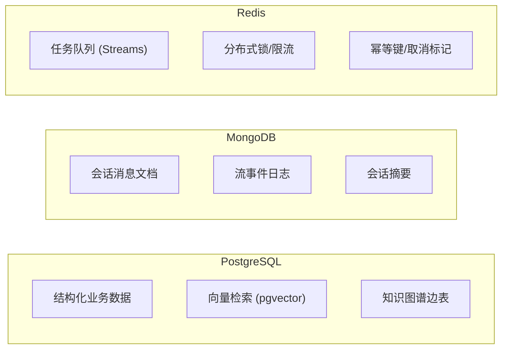

- **PostgreSQL**：承载用户、任务、资源、画像、知识图谱等结构化数据，同时通过 pgvector 扩展提供向量检索能力，避免引入独立向量数据库。
- **MongoDB**：会话消息天然是文档结构（多轮对话、图片上下文、流事件），MongoDB 的 schema-free 特性和 TTL 索引最适合此类场景。
- **Redis**：Streams 提供轻量级任务队列（替代 Kafka/RabbitMQ），SETNX 提供分布式幂等和限流，AOF 持久化保证数据不丢失。

---

## 四、前端架构

### 4.1 整体结构

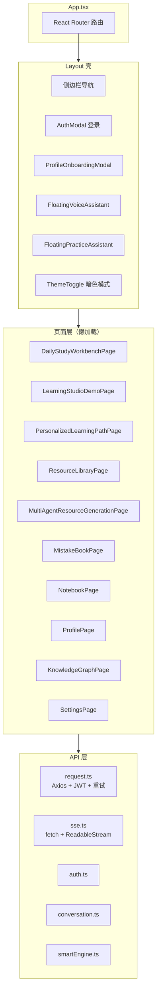

### 4.2 路由表

| 路由 | 页面组件 | 功能说明 |
|---|---|---|
| `/` | `DailyStudyWorkbenchPage` | 每日学习工作台，展示学习任务和进度 |
| `/chat` | `LearningStudioDemoPage` (mode="qna") | 智能问答对话，支持多轮对话和图片上传 |
| `/engine` | `PersonalizedLearningPathPage` | 个性化学习路径，展示知识图谱和学习计划 |
| `/resources` | `ResourceLibraryPage` | 资源库浏览，支持语义搜索和分类筛选 |
| `/resources/generation` | `MultiAgentResourceGenerationPage` | 多智能体资源生成工具 |
| `/mistakes` | `MistakeBookPage` | 错题本，基于 SM-2 间隔重复算法 |
| `/notes` | `NotebookPage` | AI 笔记本，支持 Markdown 和 Mermaid |
| `/profile` | `ProfilePage` | 学习画像，雷达图展示知识掌握度 |
| `/knowledge-graph` | `KnowledgeGraphPage` | 知识图谱探索、节点详情和依赖关系 |
| `/settings` | `SettingsPage` | 用户 LLM 配置（API Key、模型路由） |
| `/dashboard` | `Navigate` | 旧入口兼容，重定向到 `/` |
| `*` | 重定向至 `/` | 404 兜底 |

### 4.3 API 层设计

| 文件 | 职责 | 关键特性 |
|---|---|---|
| `request.ts` | Axios 实例 | JWT 注入、`Result<T>` 解包、GET 去重、5xx/429 自动重试（2 次） |
| `sse.ts` | SSE 流式解析 | `fetch + ReadableStream`，指数退避重试，事件信封标准化 |
| `auth.ts` | 认证 API | 登录、注册、退出、当前用户 |
| `conversation.ts` | 会话 API | 创建会话、历史消息、流式消息、图片上传 |
| `smartEngine.ts` | 引擎 API | 任务提交、状态查询、SSE 订阅、画像 API |
| `mistakes.ts` | 错题 API | 错题列表、复习会话、提交复习 |
| `notes.ts` | 笔记 API | 笔记 CRUD、版本历史、标签管理 |
| `resources.ts` | 资源 API | 资源搜索、收藏、进度、语义搜索 |
| `settings.ts` | 设置 API | 用户 LLM 配置读写 |
| `voice.ts` | 语音 API | WebSocket 连接、TTS 流 |

**为什么用 `fetch` 而非 `EventSource`？** 对话流和任务流都需要携带 JWT 和自定义请求头，原生 `EventSource` 不支持自定义 Header，因此统一使用 `fetch + ReadableStream` 手动解析 SSE。

**API baseURL 规则**：`VITE_API_BASE_URL` 有值时前端直接访问该地址；为空时使用同源 `/api`，由 Nginx 转发到 Java。生产容器建议保持为空走同源代理，本地 Vite 开发由 `vite.config.ts` 将 `/api` 代理到 `http://localhost:8081`。

### 4.4 关键组件

| 组件 | 功能 |
|---|---|
| `Layout.tsx` | 主壳：响应式侧边栏、会话历史搜索、用户状态、同步指示器 |
| `MarkdownRenderer.tsx` | Markdown 渲染：KaTeX 数学公式、GFM 表格、Mermaid 图表 |
| `FloatingVoiceAssistant.tsx` | 语音助手：AudioWorklet 16k PCM 采集、WebSocket 实时 ASR |
| `PPTistEditor.tsx` | 内嵌 PPT 编辑器（Vue SPA，部署于 `/pptist/`） |
| `RadarChart.tsx` | 学习画像雷达图，可视化知识掌握维度 |
| `AuthModal.tsx` | 登录/注册弹窗，支持表单验证 |
| `CodeBlock.tsx` | 代码块语法高亮 |
| `ErrorBoundary.tsx` | React 错误边界，防止白屏 |

### 4.5 Nginx 配置策略

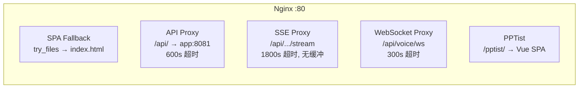

| 配置项 | 值 | 说明 |
|---|---|---|
| SSE 读取超时 | 1800s | 支持 >5 min 长任务不截断 |
| 普通 API 超时 | 600s | 覆盖资源生成等中等耗时操作 |
| WebSocket 超时 | 300s | 语音交互会话时长 |
| `client_max_body_size` | 50M | 支持图片上传 |
| 安全头 | CSP / X-Frame-Options / Referrer-Policy | 防 XSS、点击劫持 |
| 缓存策略 | hashed 资源 1y、图片 7d、index.html no-cache | 版本化静态资源长期缓存 |

新增任何流式端点时，需要同时更新 `frontend/nginx.conf` 的 SSE location 规则，保持 `proxy_buffering off`、`X-Accel-Buffering no` 和足够长的 `proxy_read_timeout`，否则前端会出现流式内容延迟、合包或被中途截断。

---

## 五、Java 控制平面

### 5.1 包结构

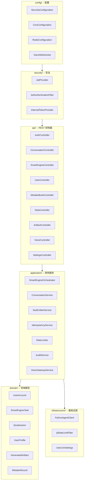

### 5.2 安全链

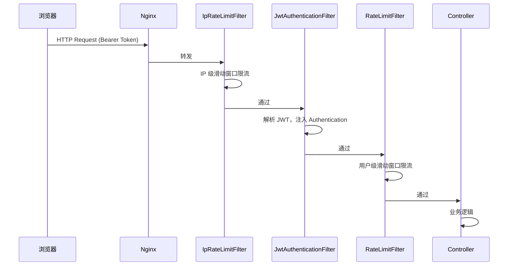

**公开端点**（无需鉴权）：
- `/api/health`、`/actuator/health` -- 健康检查
- `/api/auth/register`、`/api/auth/login` -- 认证
- `/api/voice/ws` -- WebSocket 语音
- `/api/conversations/images/*` -- 图片临时访问
- `/internal/**` -- 仅内部服务可用，由 `InternalTokenAuthenticationFilter` 校验共享 Token 后授予 `INTERNAL_SERVICE`
- OpenAPI / Swagger 文档

除上述端点外，所有 `/api/**` 业务接口默认需要 JWT。Filter 顺序为 IP 限流 → 内部 Token → JWT → 用户限流；因此内部回调和浏览器请求走不同身份路径，不应互相复用鉴权方式。

### 5.3 SmartEngine 编排器

SmartEngine 是长任务的核心编排器，负责任务生命周期管理：

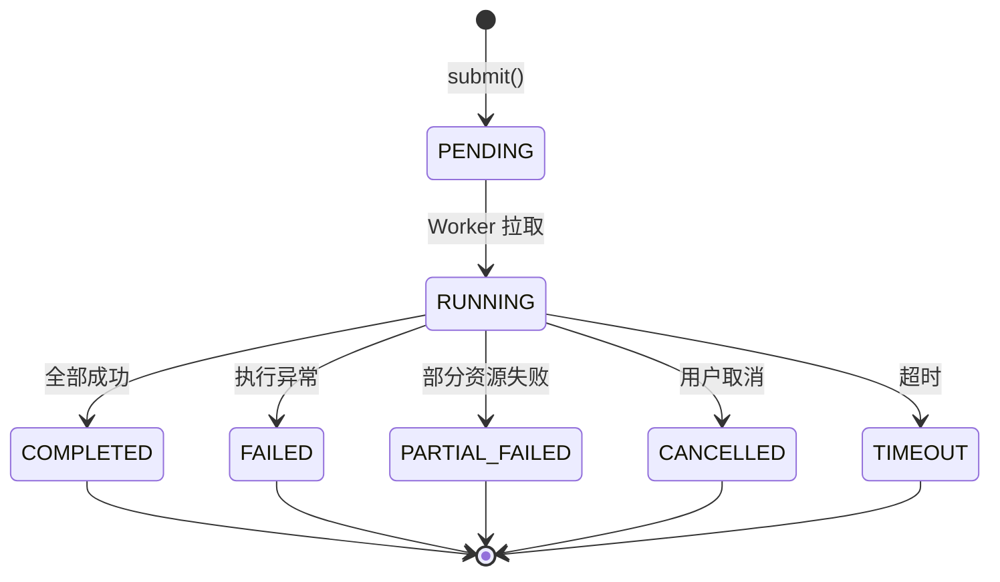

**提交流程**（`submit()`）：

1. 校验参数，创建 `SmartEngineTask`（状态 PENDING）
2. 支持 `Idempotency-Key` 头实现幂等
3. 通过 `SmartEngineQueueService` 写入 Redis Streams
4. 对于 `PERSONALIZED_LEARNING` 类型，调用 `PersonalizedLearningContextService` 聚合近 30 天学习上下文（画像、知识掌握、练习、评估、错题、资源使用）

**订阅流程**（`subscribe()`）：

1. 返回 `SseEmitter`
2. 从 `smart_engine_task_event` 表重放已持久化事件
3. 注册实时推送，新事件同时持久化 + 推送
4. 前端断线重连后自动从 `event_seq` 恢复

**取消流程**（`cancel()`）：

1. 标记任务为 CANCELLED
2. 写入 Redis cancel key（带 TTL）
3. 通知 Python `/internal/smart-engine/{taskId}/cancel`
4. 关闭所有 SSE emitters

### 5.4 对话流路径

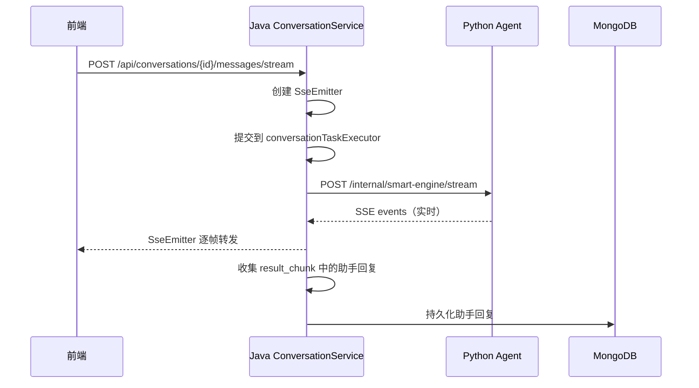

### 5.5 下载签名

生成资源的下载链接由 Java 签发，包含：
- 签名 Token（默认 1800 秒过期）
- 二次校验 provenance（不合格资源改写为 `PROVENANCE_INVALID`）
- 路径：`GET /api/assets/download/{token}`

---

## 六、Python Agent 运行时架构

### 6.1 FastAPI 入口

`python-agent/server.py` 提供以下端点：

| 路径 | 用途 | 调用方 |
|---|---|---|
| `GET /health` | 健康检查，返回 provider/model 信息 | Docker / Java |
| `POST /internal/smart-engine/stream` | 内部流式执行（对话流） | Java |
| `POST /internal/smart-engine/{task_id}/cancel` | 文件标记 + active task cancel | Java |
| `POST /internal/conversations/{conversation_id}/messages` | 写会话消息 | Java |
| `GET /internal/conversations/{conversation_id}/messages` | 查会话消息 | Java |
| `GET /internal/resources/search/semantic` | 资源库语义搜索，优先混合 RAG，必要时补充 Tavily 外部候选 | Java |
| `POST /internal/notes/analyze` | 笔记摘要、关键词和待办分析 | Java |
| `POST /internal/notes/index` | 将用户笔记分块写入 RAG 资源表 | Java |
| `GET /internal/notes/search/semantic` | 当前用户笔记语义搜索 | Java |

**启动任务**：
- Sandbox 清理循环：30 分钟检查一次，删除超过 2 小时的 sandbox 文件
- `SmartEngineStreamWorker`：消费 Redis Streams 长任务，由 `_smart_engine_worker_supervisor_loop()` 常驻守护，异常退出后按 5 秒间隔重启

所有 `/internal/*` 端点必须携带 `X-Zhixue-Internal-Token`。Python 会优先读取 `PYTHON_AGENT_INTERNAL_TOKEN`，也兼容 `/run/secrets/zhixue-python-agent-internal-token`；未配置时内部请求返回 503，Token 错误返回 401。

### 6.2 Supervisor 编排器

`PythonAgentSupervisor` 是多智能体编排的核心，负责 Agent 注册、路由解析、顺序执行和事件发射。

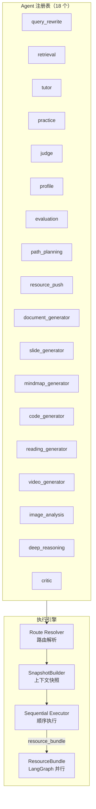

### 6.3 服务路由表

| serviceType | 路由链 | 说明 |
|---|---|---|
| `TUTORING` | QueryClassifier 动态选择 | 根据查询类型走不同路径 |
| `PROFILE_BUILD` | `tutor -> profile` | 画像构建 |
| `RESOURCE_GENERATION` | `query_rewrite -> retrieval -> resource_bundle` | 多类型资源并行生成 |
| `VIDEO_GENERATION` | `query_rewrite -> retrieval -> video_generator` | 单独视频生成 |
| `PERSONALIZED_LEARNING` | `profile -> evaluation -> query_rewrite -> retrieval -> path_planning -> resource_push -> critic` | 个性化学习主链路 |
| `PRACTICE_JUDGE` | `practice -> judge -> profile` | 练习与批改 |
| `PATH_PLANNING` | `path_planning` | 路径规划 |
| `EVALUATION` | `evaluation` | 学习效果诊断 |
| `RESOURCE_PUSH` | `resource_push` | 资源推送 |

**TUTORING 动态分支**：

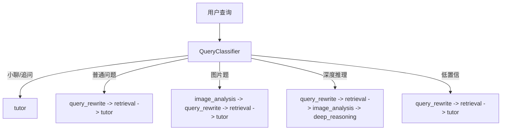

### 6.4 六层记忆系统

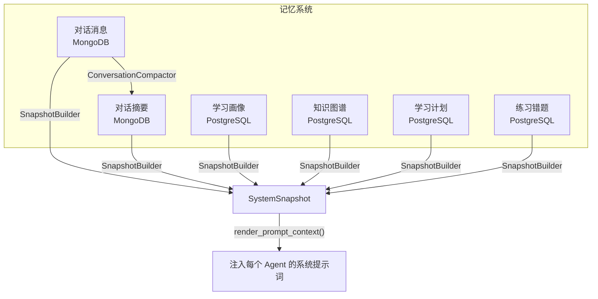

| 记忆层 | 存储 | 用途 |
|---|---|---|
| 对话消息 | MongoDB | 多轮对话、图片上下文、流事件 |
| 对话摘要 | MongoDB | 长对话压缩摘要（主题、目标、差距、进展） |
| 学习画像 | PostgreSQL | 学生水平、偏好、薄弱点、置信度生命周期 |
| 知识图谱 | PostgreSQL | 知识掌握节点和边 |
| 学习计划 | PostgreSQL | 学习路径和版本快照 |
| 练习错题 | PostgreSQL | 练习提交、错题记录、SM-2 间隔重复 |

### 6.5 LLM 配置

支持多 provider、多模型、组件级覆盖：

| Provider | 模型 | 用途 |
|---|---|---|
| OpenAI-compatible (DashScope) | qwen3.6-plus, qwen3.6-flash, qwen3.6-max-preview | 默认推理 |
| OpenAI-compatible (DashScope) | text-embedding-v4 | 向量嵌入（1024 维） |
| OpenAI-compatible (DashScope) | qwen3-rerank | 重排序 |
| MiMo | mimo-v2-omni, mimo-v2-flash | 备选推理 |
| Spark (iFlytek) | 4.0Ultra, Spark X2 | 备选推理 |

**14 个组件级覆盖槽**：`query_rewrite_llm`、`retrieval_llm`、`generation_llm`、`practice_llm`、`judge_llm`、`profile_llm`、`tutor_llm`、`conversation_summary_llm`、`planning_llm`、`review_llm`、`safety_llm`、`evaluation_llm`、`path_planning_llm`、`resource_push_llm`。

**用户级 LLM 配置**：用户可在设置页自定义 API Key 和模型路由，存储在 `app.user_llm_config` 表（加密），运行时通过 `user_runtime_config.py` 加载。

正式用户/演示任务必须优先使用设置页保存的用户 Key 和模型。只有自动化测试、创建测试账号和测试联调可以继续使用系统或环境 Key 作为默认值。

---

## 七、多智能体编排

### 7.1 编排架构

多智能体编排是本系统的核心技术创新。采用 **Supervisor 中央编排 + LangGraph 图工作流** 的混合模式：

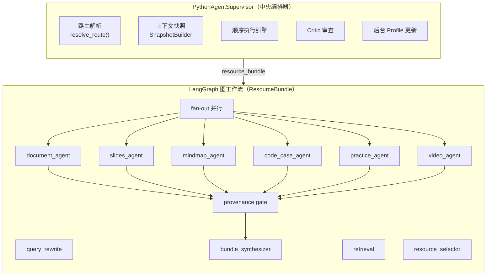

### 7.2 路由策略

路由分为 **静态模板** 和 **动态分类** 两种：

**静态模板**：从 `supervisor_routes.json` 加载，适用于 `RESOURCE_GENERATION`、`PROFILE_BUILD`、`PRACTICE_JUDGE` 等确定性场景。

**动态分类**：`TUTORING` 类型使用 `QueryClassifier` 进行确定性、可配置的查询分类：

| 查询类型 | 检索策略 | 图意图 |
|---|---|---|
| SMALL_TALK | NONE | - |
| FOLLOW_UP | CONTEXT_ONLY | - |
| IMAGE_QUESTION | LOCAL_HYBRID | - |
| NEW_CONCEPT | LOCAL_HYBRID | PREREQUISITE_PATH |
| COMPARISON | LOCAL_HYBRID | COMPARISON |
| DEEP_REASONING | DEEP_EVIDENCE | MULTI_HOP_RELATION |

### 7.3 ResourceBundle LangGraph 工作流

资源生成使用 LangGraph `StateGraph` 实现并行 fan-out：

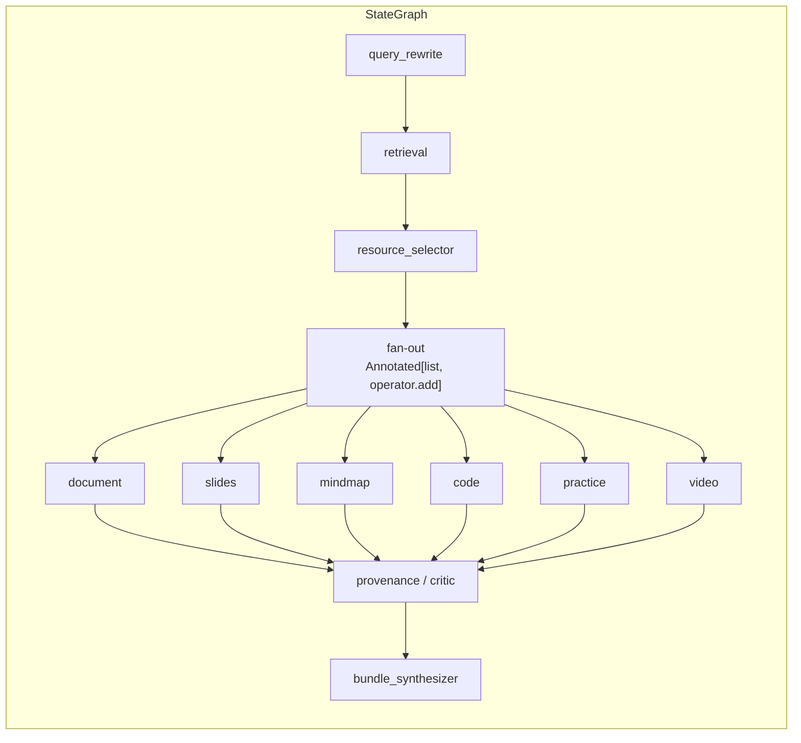

**关键特性**：
- `stream_mode=["updates", "custom"]`：同时获取节点更新和自定义事件
- `Annotated[list, operator.add]` reducer：实现并行 fan-out 合并
- 每个子 Agent 必须产出带 LLM provenance 的 `ResourceFileSSEEvent` 或 `QuestionBatchSSEEvent`
- Slides 直接生成最终课件资源，不再进入大纲确认状态

**容错策略**：
- 全失败：`error` + `done(status=FAILED)`
- 部分失败：成功资源照常发布，`done(status=PARTIAL_FAILED)` 带 `resourceFailures`
- 可发布资源必须通过 provenance gate

### 7.4 四通道 RAG 检索（核心亮点）

RAG 检索是本系统的核心技术竞争力。采用 **四路并行召回 + 加权 RRF 融合 + 纯规则 QueryClassifier** 的架构，在计算机科学教育场景下实现了高精度、低延迟的知识检索。

#### 7.4.1 整体流程

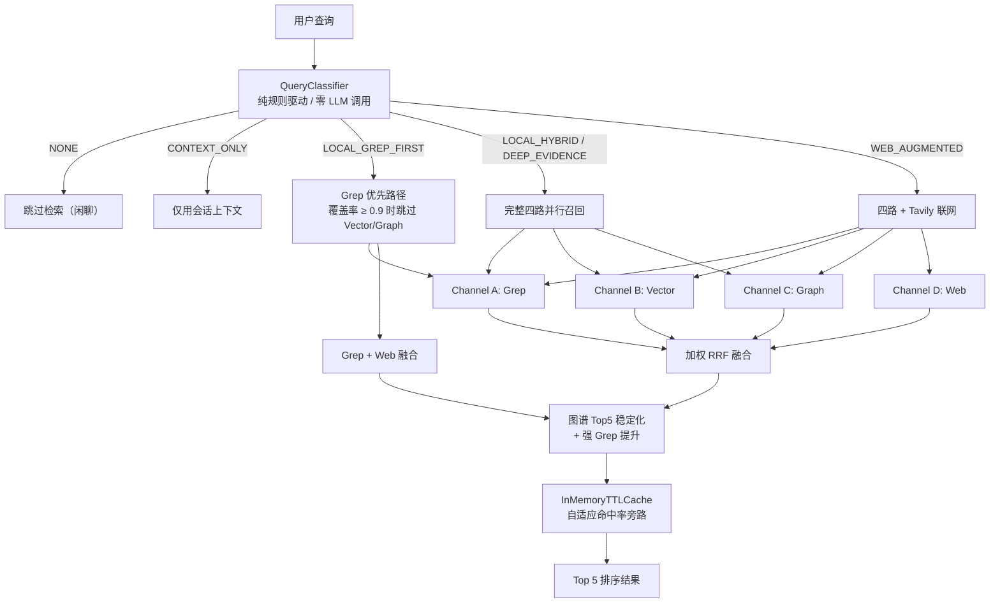

第三阶段保留普通 `LOCAL_HYBRID` 默认路径，Graph-aware 查询才启用图谱增强与工具观测；线上 `VectorSearcher` 仍保持单次 1 秒 embedding 预算。benchmark 专用持久 query embedding cache 使用 `model + dimension + sha256(query)` 作为 key，用于消除外部 embedding API 波动，不改变线上普通请求延迟。

#### 7.4.2 QueryClassifier 查询分类器

`QueryClassifier` 是检索的入口，采用 **纯规则驱动、零 LLM 调用** 设计，确保分类延迟 < 1ms 且无 API 成本。

**分类决策树**（按优先级）：

| 优先级 | 类型 | 置信度 | 检索策略 | 判断条件 |
|---|---|---|---|---|
| 1 | IMAGE_QUESTION | 0.92 | LOCAL_HYBRID | 检测到图片输入 |
| 2 | SMALL_TALK | 0.90-0.95 | NONE | 空输入或闲聊词匹配 |
| 3 | ANSWER_PREVIOUS | 0.86 | CONTEXT_ONLY | 上一轮 assistant 提问 + 当前短文本 |
| 4 | Graph intent（7 种） | 0.70-0.90 | LOCAL_HYBRID | 模板术语 > 强术语 > 弱术语组合 |
| 5 | CURRENT_INFO | 0.84 | WEB_AUGMENTED | 时效性词或 webSearch 启用 |
| 6 | ERROR_DEBUG | 0.86 | LOCAL_HYBRID | 错误类词或代码块 |
| 7 | COMPARISON | 0.82 | LOCAL_HYBRID | 对比词 |
| 8 | PROCEDURAL | 0.80 | LOCAL_GREP_FIRST | 流程词 |
| 9 | FOLLOW_UP | 0.72 | CONTEXT_ONLY | 短文本 + 跟进词 |
| 10 | NEW_CONCEPT | 0.45-0.76 | LOCAL_HYBRID | 兜底 |

**7 种 Graph intent**：PREREQUISITE_PATH（前置知识路径）、COMPARISON（对比分析）、MECHANISM_APPLICATION（机制应用）、COMMON_MISTAKE（常见错误）、COMMUNITY_SUMMARY（社区总结）、MULTI_HOP_RELATION（多跳关系）、CROSS_LAYER_RELATION（跨层关系）。

**Deep Quality Mode**：当 `reasoningMode="DEEP"` 时，LOCAL_HYBRID / LOCAL_GREP_FIRST 自动升级为 DEEP_EVIDENCE，执行更深度的检索。

#### 7.4.3 Channel A: GrepSearcher（关键词检索）

Grep 通道采用 **三阶段渐进回退** 策略，核心依赖 FMM 术语词典：

**Phase 1 — 短语精确匹配**：
将完整查询作为连续子串在 PostgreSQL 中执行 `ILIKE`，同时搜索 `rag.knowledge_chunk.content` 和 `rag.knowledge_document.title`。

| 匹配位置 | 优先级分数 | 覆盖度 |
|---|---|---|
| title == query | 400 | 1.0 |
| title startswith query | 350 | 0.98 |
| query in title | 300 | 0.95 |
| body match | 200 | 0.9 |
| 兜底 | 100 | 0.85 |

**Phase 1.5 — FMM 子短语搜索**：
Phase 1 无命中时，用 FMM 分词器将查询拆分为术语单元，对每个术语分别执行短语搜索。术语 IDF 值用于加权：标题匹配 `score = (priority_score + idf × 10) × score_factor`，正文匹配 `score = (priority_score + idf × 5) × score_factor`。

**Phase 2 — Token IDF 覆盖率回退**：
前两阶段均无命中时，对每个 token 执行 `ILIKE`，按 IDF 加权覆盖率排序。`覆盖率 = Σ(匹配 token 的 IDF) / Σ(所有 token 的 IDF)`。

**FMM 分词器**（`fmm_tokenizer.py`）：
- 基于 `rag.term_lexicon` 数据库表构建前缀 Trie
- 经典前向最大匹配算法，长词优先
- 匹配成功输出 TERM 类型 Token（idf = 数据库值），失败输出 CHAR 类型（idf = 1.0）
- 同义词扩展：查询 `rag.synonym_group` 表，以 0.92 分数因子注入

#### 7.4.4 Channel B: VectorSearcher（向量语义检索）

使用阿里 DashScope `text-embedding-v4` 生成 1024 维查询向量，通过 pgvector 余弦距离 `<=>` 在 PostgreSQL 中搜索。

`search_all` 方法同时搜索两个表：
- `rag.knowledge_chunk` — 知识库文档块
- `rag.resource_chunk` — 学习资源块（需 `status='ACTIVE'` 且 `access_scope='GLOBAL'`）

相似度计算：`similarity = ROUND((1 - (embedding <=> query_vec))::numeric, 4)`

带指数退避重试机制，处理 Embedding API 的网络波动。

#### 7.4.5 Channel C: GraphExpander（知识图谱扩展）

图谱扩展是 RAG 精度的关键差异化通道，基于 `rag.wiki_link` 双向边和 `rag.wiki_page_graph_features` 实现。

**1-hop 扩展**（所有 Graph-aware intent）：
- 从 seed slugs 出发，查询 `wiki_link` 表的双向边
- 边权重：`WIKILINK` 关系 = 2，`SHARED_TAG` 关系 = 1
- 过滤条件：`SHARED_TAG >= 3` 或 `WIKILINK > 0`

**2-hop 扩展**（仅 PREREQUISITE_PATH intent）：
- 从 1-hop 节点继续扩展，分数衰减因子 0.45
- 每个 1-hop 节点最多扩展 3 个 2-hop 邻居
- 总候选上限 24

**得分公式**：
```
score = base_score + query_bonus + community_bonus + pagerank_bonus
```

| 分项 | 计算方式 |
|---|---|
| `base_score` | `wikilink_count × 2 + shared_tag_count`（2-hop 再 × 0.45） |
| `query_bonus` | 术语精确匹配 slug/title +3.0，匹配 alias +2.5，部分匹配 +1.5 |
| `community_bonus` | 与 seed 同社区 +0.75 |
| `pagerank_bonus` | `pagerank_score × 0.5` |

**前置知识证据构建**（`build_prerequisite_evidence`）：
从查询中提取直接证据术语，搜索 `wiki_page` 的 slug/title/aliases/tags，将高匹配度候选标记为 `protectedSeeds` 和 `directEvidence`，在 Top5 稳定化中受保护。

#### 7.4.6 Channel D: TavilySearcher（联网搜索）

严格 opt-in，仅在用户显式启用或 QueryClassifier 判定为 CURRENT_INFO 时调用。请求参数：`search_depth="basic"`，超时 8 秒。对时间敏感查询自动追加当前日期。

#### 7.4.7 加权 RRF 融合

采用加权 Reciprocal Rank Fusion，公式：

```
RRF_score(item) = Σ channel: weight × priority_boost × slug_penalty / (k + rank + 1)
```

**通道权重**：

| 通道 | 默认权重 | 说明 |
|---|---|---|
| Grep | 3.0 | 短语匹配结果额外 1.5x 加成 |
| Vector | 5.0 | 语义检索主权重 |
| Graph | 0.5-1.8 | 按 intent 动态调整 |
| Web | 1.5 | 联网搜索 |

**Graph 权重按 intent 动态调整**：

| Intent | Graph 权重 |
|---|---|
| PREREQUISITE_PATH | 1.8 |
| MULTI_HOP_RELATION | 1.6 |
| COMMUNITY_SUMMARY | 1.5 |
| CROSS_LAYER_RELATION | 1.4 |
| MECHANISM_APPLICATION | 1.4 |
| COMMON_MISTAKE | 1.3 |
| COMPARISON | 1.2 |
| 其他 | 0.5 |

**后处理**：
- **图谱 Top5 稳定化**：对 PREREQUISITE_PATH intent，确保图谱结果在 Top5 中有足够代表，`protectedSeeds` 和 `directEvidence` 不被挤出
- **强 Grep 提升**：对 Graph-aware intent，如果 grep top 命中覆盖度 ≥ 0.98，将其提升到第 1 位；第三阶段额外保护强 grep top3 中已在 top5 的 canonical 证据，避免被外部资源页挤出
- **Graph seed canonical 化**：仅对 graph-aware intent 将 `wiki://...` seed 规范化为知识页 slug，并跳过低价值 graph seed
- **Direct evidence 保护**：对显式短术语、标题尾部和 canonical slug 进行保守匹配，保护直接证据进入 Top5
- **Slug 惩罚**：对图谱结果中的低价值 slug 施加惩罚（None → 0.25，HTTP 链接 → 0.35，视频 → 0.4，wiki:// → 0.6，正常知识页 → 1.0）；已验证不做全局 `wiki://` 过滤，因为该策略会降低图谱 hit@3

#### 7.4.8 InMemoryTTLCache 缓存

检索结果通过 `InMemoryTTLCache` 缓存，避免重复检索：

| 特性 | 实现 |
|---|---|
| 线程安全 | `RLock` |
| 有界淘汰 | LRU，默认 256 条目 |
| TTL 过期 | 基于 `monotonic` 时钟 |
| 深拷贝 | `deepcopy` 防止引用污染 |
| 缓存键 | payload 递归规范化后 SHA-256 |
| 大值过滤 | 超 256KB 不缓存 |
| 自适应旁路 | 命中率 < 10% 时旁路 60 秒，每 20 次请求探测恢复 |

#### 7.4.9 RAG 质量指标

**基础 100 题**（四路混合检索，第三阶段）：

| 指标 | 值 |
|---|---|
| hit@1 | 100% |
| hit@3 | **100/100** |
| 成功率 | 100% |
| 平均延迟 | 861.07ms |
| 中位延迟 | 874.50ms |
| P95 延迟 | 972.03ms |
| channelErrorCount | 0 |
| 平均相关性 | 0.909 |

**图谱型 100 题**（Graph-aware intent，第三阶段）：

| 指标 | 值 |
|---|---|
| hit@1 | 56% |
| hit@3 | **94/100** |
| 成功率 | 100% |
| 平均延迟 | 652.38ms |
| 中位延迟 | 645.87ms |
| P95 延迟 | 765.35ms |
| channelErrorCount | 0 |
| primaryTop5 | 98.0% |
| anyRelatedTop5 | 95.0% |
| evidenceNodeRecallTop5 | 85.67% |
| completeEvidenceTop5 | 63.0% |
| overallPass | true |

Graph benchmark 固化门槛字段：`passHitAt3`、`passLatency`、`passChannelErrors`、`passPrimaryTop5`、`passEvidenceRecall`、`passCompleteEvidence`、`overallPass`。诊断字段保留 `strongGrepTop3`、`wikiTraversal`、`channelErrors`，并按 intent 输出 `lowEvidenceRecordsByIntent`；低证据修复通过 `graph_low_evidence_repairs.json` 和导入层复现，不手工修改数据库。

报告文件：`python-agent/reports/rag_100_phase3_20260614.json` 和 `python-agent/reports/graph_rag_100_phase3_pass_20260614.json`。

### 7.5 Agent 接口契约

所有 Agent 继承 `PlaceholderAgent`，实现统一接口：

```python
class PlaceholderAgent:
    def system_prompt(self, snapshot: SystemSnapshot) -> str: ...
    async def run(self, ...) -> AsyncIterator[SSEEvent]: ...
```

SSE 事件子类型：

| 事件类型 | 用途 |
|---|---|
| `ProgressSSEEvent` | 进度更新（stage, percent, message） |
| `ResultChunkSSEEvent` | 流式文本块（逐 token） |
| `ResourceFileSSEEvent` | 生成资源文件（带 provenance） |
| `QuestionBatchSSEEvent` | 练习题批次 |
| `JudgeResultSSEEvent` | 批改结果 |

### 7.6 自主学习循环

系统支持 Level 3 目标循环规划：

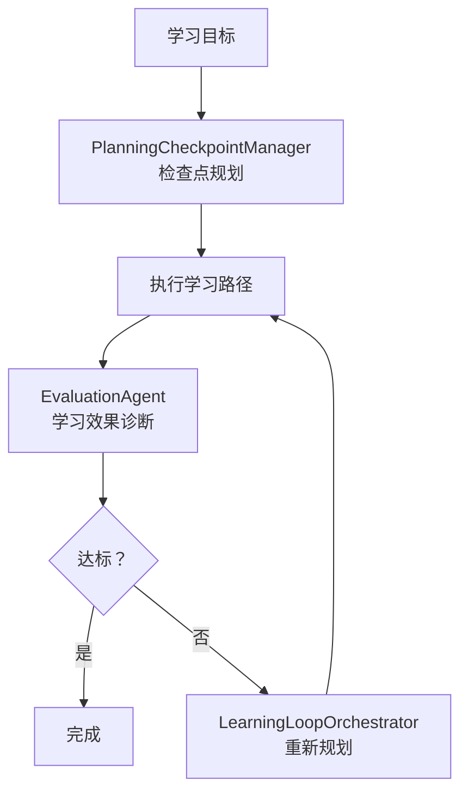

- `LearningLoopOrchestrator`：管理学习循环的迭代
- `PlanningCheckpointManager`：基于检查点的重新规划
- `AutonomousPresetRouter`：更高层的自主规划预设

---

## 八、数据架构

### 8.1 数据库 ER 关系

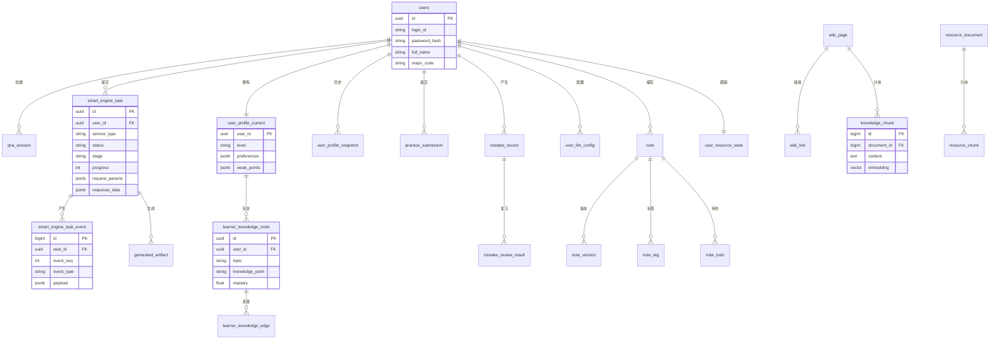

### 8.2 PostgreSQL 三 Schema 架构

| Schema | 职责 | 主要表 |
|---|---|---|
| `app` | 业务数据 | `users`、`qna_session`、`smart_engine_task`、`smart_engine_task_event`、`generated_artifact`、`user_profile_current`、`learner_knowledge_node`、`learner_knowledge_edge`、`learning_plan`、`practice_submission`、`mistake_record`、`note`、`audit_log`、`user_llm_config` |
| `rag` | 知识库与向量 | `wiki_page`、`wiki_link`、`wiki_page_graph_features`、`term_lexicon`、`synonym_group`、`knowledge_document`、`knowledge_chunk`、`resource_document`、`resource_chunk`、`user_profile_vector`、`video_generation_task` |
| `storage` | 对象元数据 | `resource_object`（bucket、key、MIME、checksum） |

### 8.3 MongoDB 集合

| 集合 | 用途 | 索引 |
|---|---|---|
| `conversation_threads` | 会话线程 | user_id + updated_at |
| `conversation_messages` | 消息文档（多轮对话、图片上下文） | conversation_id + created_at |
| `conversation_stream_events` | 流事件日志 | conversation_id + seq，TTL 索引自动清理 |

### 8.4 Redis 数据结构

| 类型 | Key | 用途 |
|---|---|---|
| Stream | `zhixue:smart-engine:tasks` | 任务队列 |
| Stream | `zhixue:smart-engine:tasks:dlq` | 死信队列 |
| String | `zhixue:smart-engine:cancel:{taskId}` | 取消标记（带 TTL） |
| String | `idempotency:{userId}:{op}:{key}` | 幂等键（SETNX + TTL） |
| Sorted Set | `ratelimit:ip:{ip}` | IP 滑动窗口限流 |
| Sorted Set | `ratelimit:user:{userId}` | 用户滑动窗口限流 |
| String | `smart-engine-leader-lock` | Worker 选举锁 |

### 8.5 枚举类型

| 枚举 | 值 | 用途 |
|---|---|---|
| `task_status` | PENDING / RUNNING / COMPLETED / FAILED / CANCELLED / TIMEOUT | 任务状态机 |
| `service_type` | PERSONALIZED_LEARNING / RESOURCE_GENERATION / ...（10 种） | 服务类型 |
| `resource_type` | DOCUMENT / PPT / QUIZ / VIDEO / MINDMAP / CODE / ...（12 种） | 资源类型 |
| `difficulty_level` | BASIC / INTERMEDIATE / ADVANCED / MIXED | 难度等级 |
| `access_scope` | GLOBAL / COURSE / USER | 访问范围 |
| `conversation_mode` | QNA / SMART_ENGINE | 会话模式 |

---

## 九、通信协议

### 9.1 SSE 事件契约

契约文件：`contracts/sse-events.schema.json`

**Wire Format**（不可变更）：
```
event: <eventType>
data: <json>
```

**统一信封字段**：

| 字段 | 类型 | 必填 | 说明 |
|---|---|---|---|
| `event` | string | 是 | 事件类型 |
| `taskId` | UUID | 是 | 任务标识 |
| `traceId` | string | 是 | 分布式追踪 ID |
| `seq` | integer | 是 | 单调递增序列号 |
| `payload` | object | 是 | 事件载荷 |
| `dialogState` | object | 否 | 对话状态（仅对话流） |

### 9.2 事件类型一览

| 事件类型 | 载荷类型 | 说明 |
|---|---|---|
| `message` | - | 系统消息 |
| `progress` | `ProgressPayload` | 进度更新（stage, percent, message, agentName） |
| `result_chunk` | `ResultChunkPayload` | 流式文本块（text） |
| `reasoning_chunk` | `ReasoningChunkPayload` | 原始推理/思考片段，默认不公开展示，按 `publicTrace` 控制 |
| `resource_file` | `ResourceFilePayload` | 生成资源（assetType, title, fileName, downloadUrl + provenance） |
| `question_batch` | `QuestionBatchPayload` | 练习题批次（questions[] + provenance） |
| `judge_result` | `JudgeResultPayload` | 批改结果 |
| `done` | `DonePayload` | 任务完成（status: SUCCESS/FAILED/PARTIAL_FAILED） |
| `error` | `ErrorPayload` | 错误（code, message） |
| `video_gen:start` | `VideoGenerationPayload` | 视频生成开始 |
| `video_gen:script` | `VideoGenerationPayload` | 脚本生成 |
| `video_gen:speech` | `VideoGenerationPayload` | TTS 合成 |
| `video_gen:avatar` | `VideoGenerationPayload` | 数字人生成 |
| `video_gen:complete` | `VideoGenerationPayload` | 视频完成 |

### 9.3 Provenance 溯源

所有生成资源必须携带 LLM 溯源元数据：

| 字段 | 说明 |
|---|---|
| `generatedBy` | 固定为 `LLM` |
| `contentOrigin` | 固定为 `LLM` |
| `provider` | LLM 提供商 |
| `model` | 模型名称 |
| `agentName` | 生成 Agent 名称 |
| `evidenceIds` | 引用的 RAG 证据 ID |
| `fallback` | 是否使用降级策略 |
| `fromCache` | 是否来自缓存 |

三层验证：Python 生成时写入 → Java 回调时校验 → 前端展示时读取。

### 9.4 DialogState 对话状态

| 字段 | 说明 |
|---|---|
| `conversationId` | 会话 ID |
| `turnId` | 当前轮次 ID |
| `pedagogyStrategy` | 教学策略（如 Socratic、direct） |
| `nextAction` | 建议的下一步动作 |

---

## 十、安全架构

### 10.1 安全分层

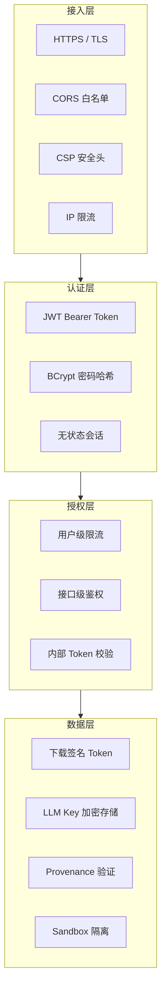

### 10.2 鉴权机制

| 通道 | 机制 | 说明 |
|---|---|---|
| 浏览器 → Java | JWT Bearer Token | 无状态，自定义 Header |
| Java → Python | `X-Zhixue-Internal-Token` | 共享密钥，仅内部网络 |
| Python Worker → Java | `X-Zhixue-Internal-Token` | 回调鉴权 |
| 下载链接 | 签名 Token | 默认 1800 秒过期 |
| 用户 LLM Key | AES 加密存储 | `APP_USER_LLM_ENCRYPTION_KEY` |

### 10.3 限流策略

采用双层滑动窗口限流：

1. **IP 级限流**（`IpRateLimitFilter`）：防止恶意请求，基于 Redis Sorted Set
2. **用户级限流**（`RateLimitFilter`）：防止滥用，基于用户 ID

### 10.4 Sandbox 隔离

- 生成资源写入共享 sandbox 目录（`/data/sandbox-temp`）
- 30 分钟清理循环，删除超过 2 小时的文件
- Java 和 Python 共享挂载，但 Java 二次校验 provenance 后才签发下载链接

---

## 十一、可靠性设计

### 11.1 重试机制

| 层 | 策略 |
|---|---|
| 前端 API | 5xx/429 自动重试 2 次 |
| 前端 SSE | 429/502/503/504 指数退避重试 |
| Java → Python | HTTP 调用超时 + 重试 |
| Python Worker | 失败任务进入 DLQ，最多重试 N 次 |

### 11.2 取消机制

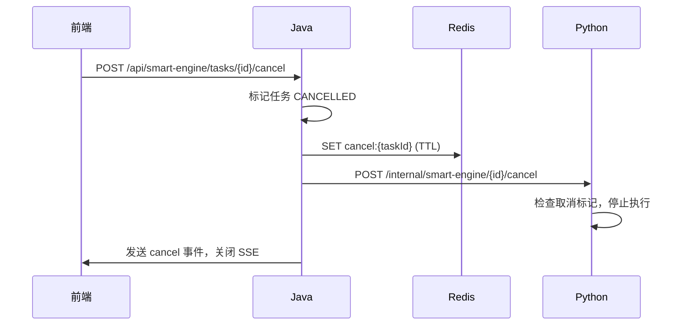

### 11.3 幂等设计

| 操作 | 幂等键 | 存储 |
|---|---|---|
| 任务提交 | `Idempotency-Key` Header | Redis SETNX + TTL |
| Worker 回调 | taskId + event_seq | PostgreSQL 去重 |
| 消息写入 | MongoDB upsert | 幂等写入 |

### 11.4 事件重放

- Java 持久化所有 `SmartEngineTaskEvent` 到 `smart_engine_task_event` 表
- `event_seq` 单调递增，前端断线重连后从上次 seq 恢复
- `SseStreamSender.sendReplayable()` 只发送 `seq > lastSentSeq` 的事件

### 11.5 超时控制

| 位置 | 超时 | 说明 |
|---|---|---|
| Nginx SSE | 1800s | 支持 >5 min 长任务 |
| Nginx API | 600s | 资源生成等操作 |
| Nginx WebSocket | 300s | 语音会话 |
| Java → Python HTTP | 可配置 | 连接 + 读取超时 |
| Redis cancel TTL | 可配置 | 取消标记过期 |
| Sandbox 清理 | 2h | 文件最大存活时间 |

---

## 十二、可观测性

### 12.1 全链路追踪

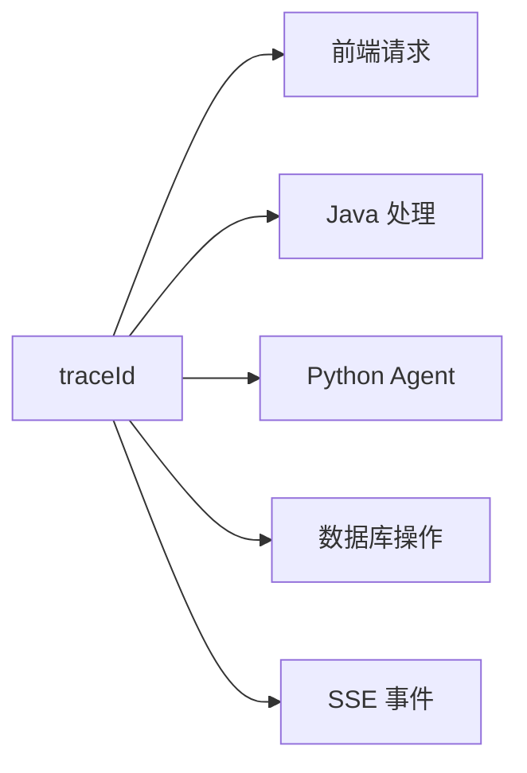

每个请求从 Java 生成 `traceId`，贯穿：
- Java Controller → Service → Repository
- Java → Python HTTP 调用（`X-Trace-Id` Header）
- Python Agent 内部处理
- SSE 事件信封中的 `traceId` 字段
- MongoDB 流事件中的 `traceId`
- PostgreSQL 审计日志中的 `traceId`

### 12.2 日志体系

| 层 | 日志类型 | 存储 |
|---|---|---|
| Java | 应用日志、审计日志 | `data/logs/` + `audit_log` 表 |
| Python | 应用日志、Agent 执行日志 | stdout（Docker 日志） |
| Nginx | 访问日志、错误日志 | 容器内 |
| 前端 | Console 错误 | 浏览器 |

### 12.3 健康检查

| 端点 | 检查内容 |
|---|---|
| `GET /api/health` | Java 服务健康，返回 200 |
| `GET /health` | Python 服务健康，返回 provider/model 信息 |
| Docker healthcheck | PostgreSQL（pg_isready）、MongoDB（ping）、Redis（ping） |

### 12.4 审计日志

`app.audit_log` 表记录关键操作：
- 用户登录/注册
- 任务提交/取消
- 资源生成/下载
- 配置变更

---

## 十三、扩展性设计

### 13.1 新增 Agent

添加新 Agent 只需三步：

```mermaid
flowchart LR
    S1["1. 实现 Agent 类<br/>继承 PlaceholderAgent"] --> S2["2. 注册到 Supervisor<br/>agent_registry"] --> S3["3. 配置路由<br/>supervisor_routes.json"]
```

**步骤详解**：

1. 在 `python-agent/src/ai_modules/agents/` 下创建新 Agent 文件
2. 继承 `PlaceholderAgent`，实现 `system_prompt()` 和 `run()` 方法
3. 在 `supervisor.py` 的 `__init__` 中注册到 `agent_registry`
4. 在 `supervisor_routes.json` 中配置路由模板

### 13.2 新增服务类型

添加新 `serviceType` 只需：

1. 在 `ServiceType.java` 枚举中添加新值
2. 在 `supervisor_routes.json` 中配置路由
3. 在 `SmartEngineController` 中添加提交参数校验（如需要）

### 13.3 新增 LLM Provider

1. 在 `config.py` 中添加 provider 配置
2. 实现 `LLMProvider` 接口（如需要新的 API 格式）
3. 在组件级覆盖槽中配置模型名

### 13.4 新增资源类型

1. 在 `resource_type` 枚举中添加新值
2. 在 `ResourceBundleWorkflow` 中添加新的 fan-out Agent
3. 在前端 `MultiAgentResourceGenerationPage` 中添加 UI 支持

### 13.5 新增记忆层

1. 在 `python-agent/src/ai_modules/memory/` 下创建新的 Store
2. 在 `SnapshotBuilder` 中聚合到 `SystemSnapshot`
3. 在 Agent 的 `system_prompt()` 中引用

---

## 附录 A：部署拓扑

### Docker Compose 服务依赖

```mermaid
graph TD
    PG["postgres<br/>pgvector:pg16"]
    MG["mongo<br/>mongo:7"]
    RD["redis<br/>redis:7-alpine"]
    
    PG & MG & RD -->|"service_healthy"| PA["python-agent<br/>FastAPI + LangGraph"]
    PG & MG & RD & PA -->|"service_healthy"| APP["app<br/>Spring Boot"]
    APP --> FE["frontend<br/>Nginx + SPA"]
    
    PG ---|"127.0.0.1:5432"| Host1["Host"]
    MG ---|"127.0.0.1:27017"| Host2["Host"]
    RD ---|"127.0.0.1:6379"| Host3["Host"]
    APP ---|":8081"| Host4["Host"]
    FE ---|":80"| Host5["Host"]
```

### 数据目录

| 目录 | 用途 |
|---|---|
| `./data/postgres` | PostgreSQL 数据持久化 |
| `./data/mongo` | MongoDB 数据持久化 |
| `./data/redis` | Redis AOF 持久化 |
| `./data/logs` | Java 应用日志 |
| `./data/sandbox-temp` | 生成资源临时目录（Java + Python 共享） |
| `./wiki` | Wiki 知识库（只读挂载到 Python Agent） |

### 首次启动初始化

| 文件 | 作用 |
|---|---|
| `init.sql` | PostgreSQL schema、表、索引、触发器 |
| `restore_vector_data.sh` | 恢复 `vector_data.dump` 中的预置向量数据 |
| `mongo-init.js` | MongoDB collection、校验规则和索引 |

PostgreSQL 数据目录首次为空时才会执行 `docker-entrypoint-initdb.d` 中的初始化脚本；已有 `./data/postgres` 时不会重复执行 `init.sql` 或恢复 `vector_data.dump`。已有环境的结构调整必须走 `migrations/` 脚本，不得通过重建数据容器“重新初始化”。

Compose 中 Java 与 Python 共同挂载 `./data/sandbox-temp:/data/sandbox-temp`，这是生成资源、聊天图片和下载签名校验的共享边界；Python 同时只读挂载 `./wiki:/app/wiki:ro` 作为本地知识库来源。

### 热更新边界

当前联调/演示环境只允许 `docker cp` 热更新，**禁止**：
- `docker compose build`
- `docker compose up --build`
- `docker compose up --force-recreate`
- 重建容器或变更 Compose 拓扑

全新空环境或维护窗口才允许执行 build/recreate 类命令。

---

## 附录 B：验证清单

### 全链路功能检查

```bash
# 服务状态
docker compose ps

# Java 健康检查
curl -s http://localhost:8081/api/health

# Python 健康检查
curl -s http://localhost:8000/health

# 前端构建
cd frontend && npx tsc --noEmit && npx vite build

# RAG 测试
cd python-agent && pytest tests/ -k rag -v

# Java 单元测试
cd project && mvn test
```

### 联调检查清单

```
[ ] 登录 → JWT → localStorage 持久化
[ ] 流式对话 → SSE text/event-stream → 逐字渲染
[ ] 任务 SSE → progress/done 事件推动状态流转
[ ] resource_file downloadUrl 可下载
[ ] >5min 任务不被截断
[ ] Console 无 CORS/401/ERR_CONNECTION_REFUSED
```

### 常见联调问题排查

| 问题 | 排查方向 |
|---|---|
| SSE 流被截断 | Nginx 超时配置、`proxy_buffering` |
| CORS 错误 | `CorsConfiguration` 白名单 |
| 401 Unauthorized | JWT 过期、Token 格式 |
| 连接拒绝 | Docker 网络、端口映射 |
| 事件字段不匹配 | `sse-events.schema.json` 契约校验 |
| sandbox 路径不一致 | 容器挂载路径、权限 |

---

> 本文档由智学引擎团队维护，与代码实现保持同步。如有疑问请查阅源码或联系项目负责人。
